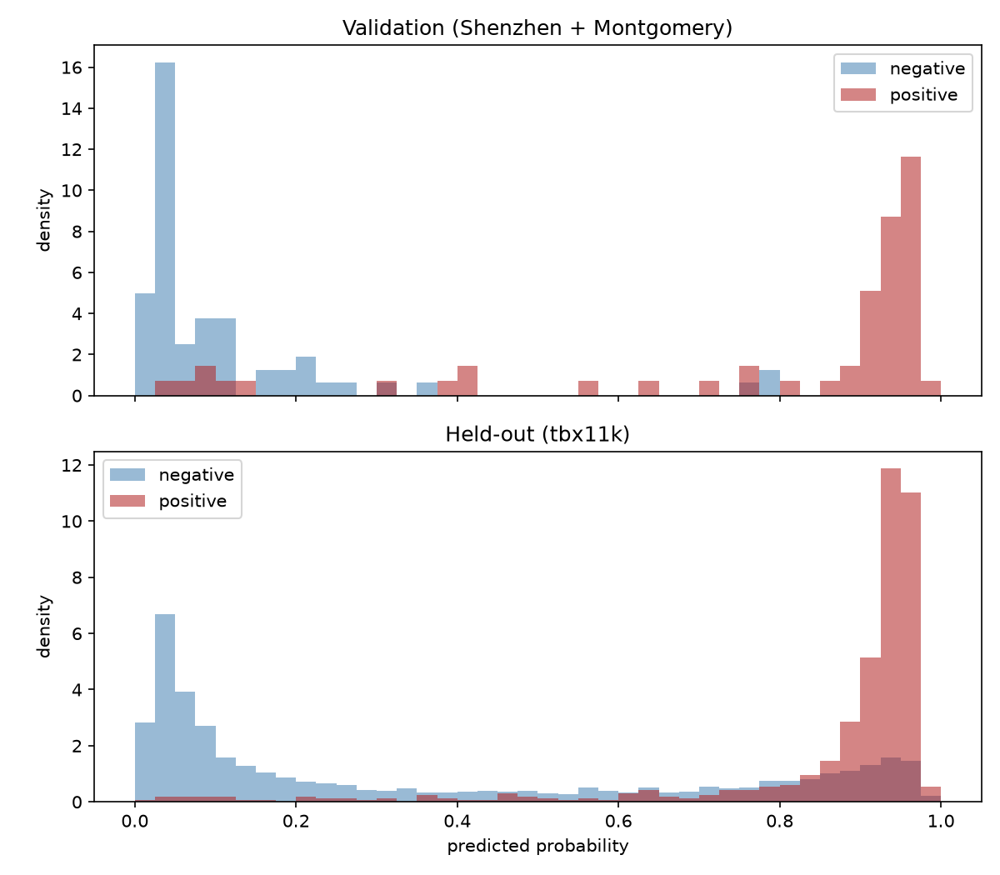
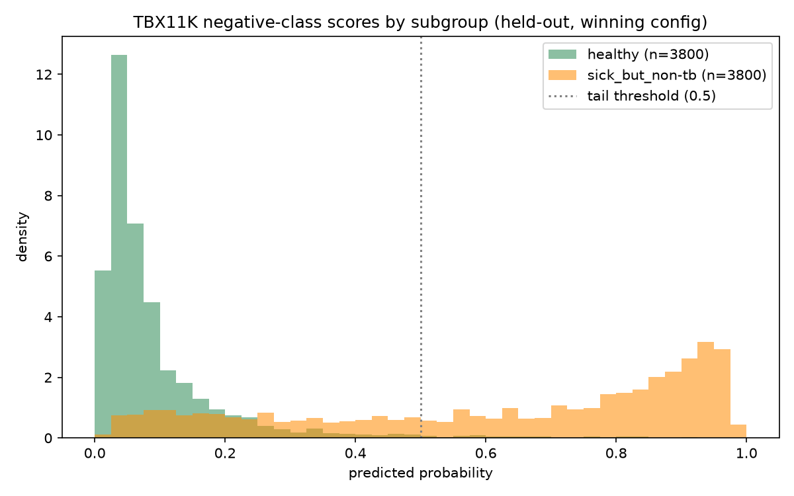
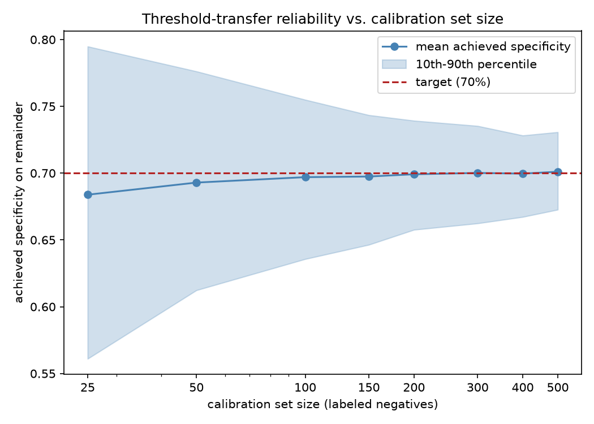
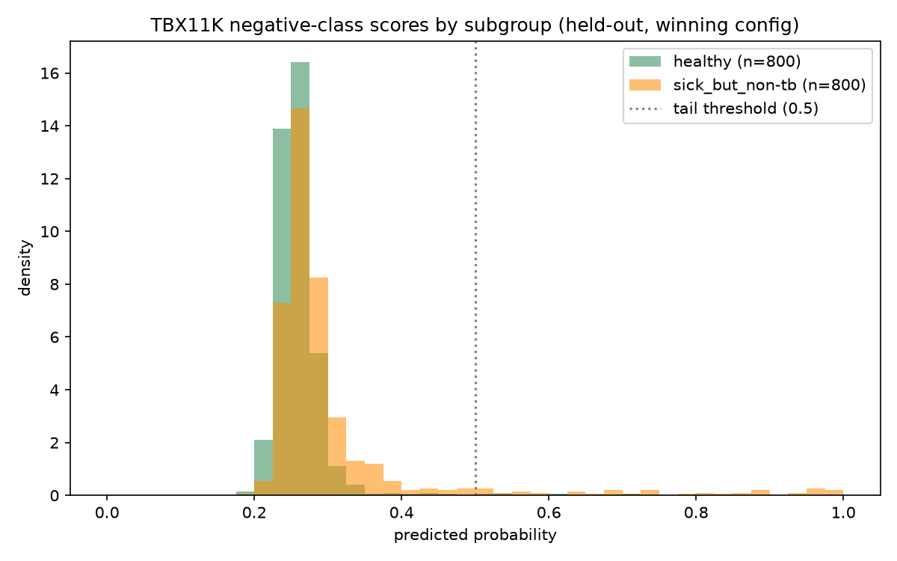
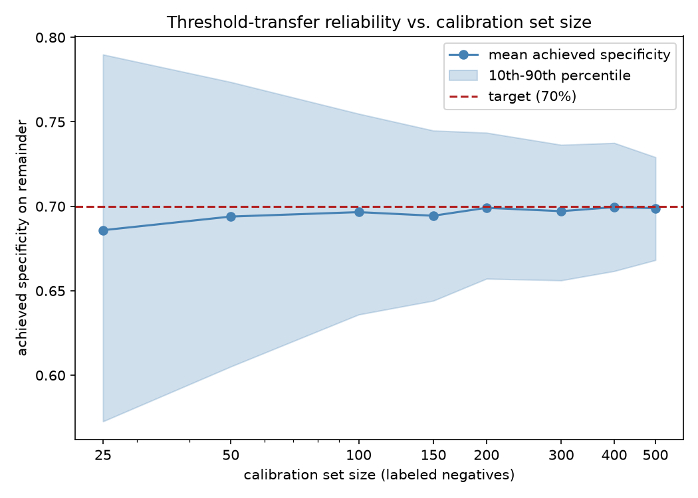

# TB CXR Diagnostic — Phase 1 & 2

Shared encoder + diagnostic head for TB detection from chest X-rays.
Targets the WHO TPP triage specification (sensitivity ≥ 90%, specificity ≥ 70%).

---

## Status (2026-08-25)

**Phase 1 — diagnostic head: done.** EfficientNet-B0 + GAP/FC, trained on
Shenzhen + Montgomery + TBX11K.

**Phase 2 — cross-source generalization: done, and it uncovered a real
confound before it found a real fix.**

- The original held-out evaluation had a threshold-leakage bug (operating
  point chosen on the same data it was scored on) — fixed; frozen-threshold
  scoring + bootstrap CIs are now standard for every held-out result
  (`eval/metrics.py`).
- Characterized, not just detected, a genuine acquisition-texture confound:
  a model trained with the entire lung field blanked out still hit 0.93 AUC
  in-domain (`lung_crop.py --mode complement`), survived a mask-dilation
  check, replicated in an independent source (Montgomery), and was
  confirmed via a fixed-location corner patch, a high-pass residual, and a
  region-by-region decomposition (`eval/histogram_probe.py`,
  `region_decompose.py`, `patch_extract.py`, `highpass_complement.py`) — all
  converging on the same acquisition-texture explanation. A label-shuffle
  control (`train_diagnostic.py --shuffle-labels`) confirmed the pipeline
  itself isn't leaking.
- Found a fix that actually works: **lung-crop + mild texture augmentation**
  gets TBX11K held-out sensitivity to **92.6% [90.3, 94.6] at 70%
  specificity** under a per-site threshold (`eval/ceiling_analysis.py`) —
  meets the WHO TPP triage sensitivity/specificity targets on held-out TBX11K
  (retrospective research split; no prospective or prevalence-adjusted
  evaluation), with a tight, non-overlapping CI against every earlier
  configuration. **This is a ceiling, not an out-of-the-box deployable
  number** — a threshold frozen from validation instead of TBX11K itself
  (`eval/frozen_threshold_check.py`) gives 98.2% sensitivity but only 44.0%
  specificity on TBX11K, well below the 70% floor; per-site threshold
  recalibration is required to actually realize 92.6%, not optional. Traced
  the mechanism to a training-data gap, not just acquisition texture:
  splitting TBX11K's held-out negatives by their own raw annotation
  (`eval/negative_composition_probe.py`) found that `sick_but_non-tb` cases
  score a median 0.722 (vs. `healthy`'s 0.055) — the model never learned to
  place non-TB pathology because Shenzhen/Montgomery's training negatives
  are almost entirely healthy. Turned the recalibration requirement into a
  concrete number via a calibration-set-size sweep: **≈250–300 labeled
  negatives from the target site to hit the 70% specificity target within
  ±5 points at ≥90% confidence**; below ~100, calibration is closer to
  noise than correction. **Then tested the direct fix**, not just the
  calibration workaround: retraining with TBX11K's own train split
  (including sick_but_non-tb) added to the negative class took
  frozen-threshold specificity from 43.8%→97.6% on identical held-out
  images and collapsed the healthy/sick_but_non-tb bimodality — confirming
  the mechanism is real and fixable at the source, though this specific
  test isn't a fair cross-source comparison (TBX11K informed training) so
  it isn't a new headline number. It also disproved this document's own
  earlier explanation for the calibration-size curve's shape (a bimodal
  "sparse valley" effect) — the curve barely moved even with the
  bimodality gone, pointing instead to a generic, distribution-free
  order-statistic effect. **Settled the causal question cleanly** with a
  single-source, single-variable, matched-training-size ablation (TBX11K
  only, no pooling or volume confound): excluding sick_but_non-tb from
  training gives 53.1% specificity on held-out TBX11K, including it gives
  99.6–99.8% — non-overlapping CIs. **But it's not a universal rule**:
  completing the third leave-one-out direction (Montgomery+TBX11K →
  held-out Shenzhen) with the same "include everything" recipe *fails*
  (ceiling 66.7%, a genuine discrimination collapse, not calibration) —
  restricting TBX11K's contribution to healthy-only recovers it to 94.6%.
  The correct recipe depends on whether the deployment target's own
  negatives are predominantly healthy (Shenzhen-like — exclude non-TB
  pathology from training) or mixed (TBX11K/Montgomery-like — include it).
  An augmentation-strength sweep
  (mild/medium/aggressive) confirmed the mechanism: too-aggressive texture
  randomization destroys real diagnostic texture (cavitation, nodules) along
  with the confound, and mild wins because it removes less signal overall
  while removing more of the *wrong* signal. A CXR-pretrained DenseNet
  encoder swap tied this result without improving on it; AdaBN test-time
  adaptation added a small free AUC gain with no measurable ceiling movement.
- Full methodology, numbers, and the "what didn't work and why" trail are in
  **Phase 2 validation results** and **Robustness interventions** below —
  worth reading in full before citing just the headline number, since
  several earlier configurations looked fine until checked harder.

**Phase 3 — reconstruction head: trained at full scale, with the
DRR -> real-CXR domain gap now measured rather than assumed.** Delivered
model: `outputs/phase3_recon_run4_nosi/latest.pt` (8000 steps, 320px/128³,
mild DRR realism on 50% of paired samples, no unpaired shape-induction
term). Five full-scale runs, and two measurement instruments built along
the way, established three things that reverse earlier readings of this
project's own numbers: the unpaired shape-induction term was *hurting*
reconstruction geometry and patient conditioning; run 2's headline
PSNR/SSIM (28.33 / 0.733) came largely from predicting a near-identical
volume for every patient (cross-patient r = 0.963); and DRR realism
augmentation does not close the domain gap, though it does buy real
robustness to film-like inputs. Still an unvalidated visualization per
§11a. Full trail in "DRR -> real-CXR domain gap" below. `code/recon/`:

- `ct_data.py` — loads a real LIDC-IDRI DICOM series directly (DiffDRR reads
  the directory with no manual conversion) and generates DRRs at random
  poses. Verified: full-resolution volumes OOM the local 4GB card (>3.7GB);
  resampling to ~2.5mm spacing (~128 voxels/axis) keeps DRR generation under
  ~2GB, matching the proposal's §9 128³ target.
- `models/recon_head.py` — `ReconHead`, a right-sized back-projection
  network (2D feature -> channel-to-depth lift -> 3D conv decoder), 0.35M
  params, DuoLift-CNN-*inspired* per §6, not a vendored copy of the
  released code/weights. Wired into `TBDiagnosticModel` via
  `build_model(..., with_recon=True)`.
- `recon/firewall_test.py` — automated check of the §11a isolation
  guarantee (value identity + gradient isolation, both directions). Passes.
  This is enforced structurally (`forward()` never references
  `self.recon_head`), not just documented.
- `recon/train_recon.py` — paired DRR-supervised loss (real CT -> DRR ->
  predicted volume -> compare to the CT's own density) plus unpaired shape
  induction on real CXRs (Sizikova et al. — predicted volume re-projected
  through DiffDRR, compared against the original input image; no CT ground
  truth needed for this term). **Two real bugs found and fixed while
  verifying this on real data, not synthetic placeholders:** (1) an
  unconstrained final layer produced exactly-zero gradients through the
  re-projection loss — CT density is physically non-negative and the
  renderer degenerates on near-zero/negative input; fixed with `softplus`.
  (2) a silent shape mismatch between `ReconHead`'s fixed volume_size cube
  and each CT's actual (non-cubic) resampled geometry was scrambling the
  renderer's ray indexing without erroring — caught via an identical loss
  value across different random initializations, which shouldn't happen;
  fixed by resizing the prediction to the canonical geometry before
  substitution. After both fixes: real, non-zero gradients confirmed on both
  loss terms, and shape-induction loss measurably decreases over a short
  smoke run (2.22 → 0.78 over 8 steps).
- `recon/export.py` — NRRD/NIfTI export via SimpleITK, each file tagged
  "SYNTHESIZED" at the metadata level (belt-and-braces alongside the §11a
  code-level guarantee, not a replacement for it).
- `recon/drr_realism.py` — film-like augmentation of the paired DRR input
  (body crop, tone curve, scatter, blur, edge enhancement, noise), applied
  to a random fraction of training samples (`--drr-realism mild
  --drr-realism-prob 0.5`). Input-only; the CT target is untouched.
- `recon/domain_gap_probe.py` — measures the DRR -> real-CXR gap for a
  checkpoint without paired real ground truth (none exists publicly):
  encoder-feature separation and predicted-volume statistics vs. the real
  CT population. See "DRR -> real-CXR domain gap" below.
- `tests/` — pytest unit tests for the two modules above
  (`python -m pytest tests/`).

**Training run (completed).** Driven headlessly via the Kaggle CLI
(`kaggle kernels push`), not the browser — `code/tb_phase3_kaggle.ipynb`,
GPU T4, ~4 hours (06:12→10:20 UTC). Verified from the full run log, not
assumed from a "COMPLETE" status alone:
- 150/150 LIDC-IDRI CT series fetched, 0 failures.
- 10,696 unpaired real CXRs available for the shape-induction term (this
  confirms the `/kaggle/input/datasets/<owner>/<slug>/` mount-path fix
  actually worked — the prior run silently found 0 and skipped the term
  entirely).
- 2000/2000 training steps completed, 0 errors/tracebacks in the entire log.
- Paired DRR-supervision loss: 0.3782 → 0.1511 → 0.0789 (clean, substantial,
  monotonic-ish decrease).
- Shape-induction loss: 1.4689 → 0.6563 → 1.1237 at three spot-checked
  points (noisier, as expected for an unpaired re-projection term, but
  consistently well below the ~2.0 uncorrelated-baseline ceiling). **This
  three-point sample reads like a late divergence; the full 100-point
  per-20-step trace (below) shows it isn't one** — an early convergence
  phase followed by a flat, noisy plateau, with the last logged value
  (1.1237, at step 2000) just an outlier within that noise, not the start
  of a trend.
- Final export ran on a real held-out CXR (`s1559.png`), not a synthetic
  fallback — confirms a genuine end-to-end real-data path, not just a
  shape-check.

**Loss-trajectory diagnosis (full 100-point trace, every 20 of 2000 steps,
extracted from the Kaggle run log — not re-run, this data already
existed).** Windowed means (200-step / 10-point windows):

| Steps | Shape-induction mean | std |
|---|---|---|
| 20–200 | 1.355 | 0.456 |
| 220–400 | 1.168 | 0.464 |
| 420–600 | 0.954 | 0.293 |
| 620–800 | 0.933 | 0.265 |
| 820–1000 | 0.912 | 0.218 |
| 1020–1200 | 0.824 | 0.095 |
| 1220–1400 | 0.805 | 0.137 |
| 1420–1600 | 0.845 | 0.212 |
| 1620–1800 | 0.780 | 0.114 |
| 1820–2000 | 0.834 | 0.181 |

**There is no divergence to fix.** The term drops ~40% over the first
~1000 steps (1.36→~0.82) then plateaus — a linear fit over steps 1000–2000
gives a slope of +0.00003/step (+3.8% of the plateau mean over the full
1000 steps, well inside the plateau's own noise band, std≈0.16); over the
*full* run the slope is negative (-0.00025/step, a genuine ~0.50 net
decrease). The paired-loss term keeps improving throughout, including
during the shape-induction plateau (slope -0.065/1000 steps in the same
window) — no sign of the shared encoder being pulled backward by the
unpaired term. Step-to-step, `corr(Δpaired, Δshape_induction) = 0.05`
— essentially zero — meaning the two terms aren't fighting each other
either; they fluctuate independently. **The original three-point summary
(spot-checking early/mid/last) happened to land on a low point (0.66) and
then the single final logged value (1.12, an ordinary draw from the noisy
plateau) — that reads as a "turn" with three points and doesn't exist in
the full trace.** No retraining, no loss-weight rebalancing, and no
uncertainty weighting is warranted by this evidence; the honest
conclusion is closer trend-reading corrects the earlier framing, not that
a fix was needed and applied. Worth revisiting only if a longer future run
shows the plateau actually trending upward over a wider window than
tested here — it doesn't, in the one run that exists.

This is a single run, not a validated model: no held-out generalization
check at training time (all 150 CT series informed the paired loss, see
below), no hyperparameter search. It demonstrates the pipeline trains
stably end-to-end on real data at real scale — that alone does not
demonstrate reconstruction quality, which is why the check below exists.

**Quantitative validation against held-out paired CT (§10, `recon/eval_paired.py`)
— the answer to "is this a thorax or plausible-looking noise."** Every one
of the 150 CT series already fetched trained the paired-supervision loss,
so none of them are a valid held-out set; fetched 12 more, genuinely
disjoint (`datasets/lidc-idri/manifest_heldout12.tcia`, verified by
`SeriesInstanceUID` set difference, not assumed from slice arithmetic).
For each: render a canonical-pose DRR, predict a volume, compare against
the real CT's own resampled density.

| Metric | Mean | Std | Range (n=12) |
|---|---|---|---|
| PSNR | 15.99 | 1.73 | [13.41, 20.56] |
| SSIM | 0.245 | 0.053 | [0.144, 0.337] |
| LPIPS (per-slice avg.) | 0.595 | 0.021 | [0.563, 0.633] |
| Projection MSE (normalized) | 0.310 | 0.082 | [0.193, 0.469] |

*(These are the original 2000-step Kaggle checkpoint's numbers. A
diagnosed-and-fixed mechanism further below in this section — a slow-to-
move softplus bias, compounded by an I/O bottleneck limiting how many
steps were affordable — was confirmed with a matched-scale 8000-step
Kaggle rerun: PSNR 15.99→28.33 and SSIM 0.245→0.733, both now clearing
this section's own "looks like the target" benchmarks, though LPIPS and
projection-consistency moved the other way — see "The undertraining
hypothesis, tested properly" for the full comparison and the honest
caveat on what didn't improve alongside the headline numbers.)*

**The honest answer: not yet a thorax, by direct voxel comparison — but
not pure noise either.** PSNR ~16dB and SSIM ~0.24 are low by the
standards of successful medical image reconstruction (where PSNR>25dB and
SSIM>0.6 are typical benchmarks for "this looks like the target");
LPIPS ~0.60 (AlexNet backbone) sits well into "perceptually different"
territory, not "similar." Voxel-level fidelity against real, unseen CT is
poor. The one metric that reads better is projection consistency: 0.31 on
a z-score-normalized scale where 2.0 is the uncorrelated-random ceiling
(established via the shape-induction loss analysis above) — the
re-projected prediction retains real, non-trivial correlation with the
input DRR's coarse shape, clearly better than chance, just not close
enough to call it accurate.

**Mechanism check (local inference, no retraining) — this refines "not
generalizing" into something more specific and more useful.** Inspected
predicted-vs-target density directly on four held-out series. Real CT
density is highly skewed: ~50–63% of voxels are near-zero air/background
(`target frac<0.02`), with the rest forming the actual thoracic structure.
The predicted volumes are never near-zero anywhere — **0% of predicted
voxels fall below 0.02 on every series checked**, predicted mean sits at
0.42–0.44 regardless of the target CT's own mean (0.075–0.099), and
predictions from *different, unrelated* CT inputs correlate with each
other at r=0.68–0.79. **Read together, this is not "hasn't converged
yet" — it's the model predicting something close to a single averaged,
input-invariant density blob, with a smaller amount of real per-input
variation layered on top**, which is exactly what the projection-
consistency result (real but weak) would look like if every DRR shares a
similar coarse thoracic silhouette regardless of the actual patient. The
"coarse shape prior" characterization above still holds, but the
mechanism is sharper than "not enough training": plain MSE against a
target that's mostly near-zero has a well-known failure mode where the
loss-minimizing safe prediction is a smoothed value near the target's
mean almost everywhere, rather than learning the sparse, patient-specific
structure — the model may be sitting in exactly that local optimum rather
than being partway to a better one.

**Candidate fix tested — L1 loss does not fix this, at least not quickly.**
Added a `--paired-loss {mse,l1}` option to `recon/train_recon.py`
(`paired_step` now takes `loss_fn`) since L1 is the standard alternative
for this exact failure mode — it penalizes large deviations less
quadratically and is known to favor sparser solutions on skewed targets —
plus `--diagnose-every N` to print the near-zero-fraction check during
training instead of only inferring it after the fact. First local attempt
misdiagnosed the run as stuck (0% GPU utilization on one `nvidia-smi`
snapshot) and killed it; timing the pipeline afterward showed
`load_ct_volume` alone takes ~7–9s per call against ~0.3–0.4s for the
model forward/backward — at that ratio a random snapshot is far more
likely to catch the CPU-bound CT-load phase than the brief GPU burst, so
0% GPU utilization was normal I/O-bound behavior, not a hang. The earlier
run was also silently empty in its log file only because Python
block-buffers stdout when redirected to a file — re-ran both with `-u`
(unbuffered) and the runs were fine throughout, just slow.

Reran MSE and L1 side by side, matched scale
(`--image-size 192 --volume-size 48`), matched checkpoints (steps 25/50/75):

| Step | MSE: pred min / mean / frac&lt;0.02 | L1: pred min / mean / frac&lt;0.02 |
|---|---|---|
| 25 | 0.454 / 0.538 / 0.0% | 0.515 / 0.625 / 0.0% |
| 50 | 0.407 / 0.507 / 0.0% | 0.389 / 0.531 / 0.0% |
| 75 | 0.410 / 0.494 / 0.0% | 0.429 / 0.509 / 0.0% |

**No meaningful difference between the two loss functions at this scale
and duration — both stay at 0% near-zero throughout, neither shows any
movement toward the target's sparse structure.** The L1 hypothesis was a
reasonable one and is now a tested negative, not an untested guess: swapping
the loss function alone doesn't resolve this within 75 steps. Plausible
remaining explanations, none tested: the softplus floor plus current
initialization may need substantially more steps to unlearn a
positive-biased starting point regardless of loss shape (the original
2000-step full-scale run showed the same pattern, so "more steps" hasn't
actually been ruled out — 75 reduced-scale steps is not comparable);
an explicit sparsity term (e.g., an L1 penalty *on the prediction itself*,
not just the reconstruction error) might be needed rather than swapping
the reconstruction loss; or the architecture's 2D-to-3D "lift" may not be
the bottleneck at all and this is closer to an inherent difficulty of
single-view 3D reconstruction at this model scale. Reporting the tested
negative rather than moving on to the next guess without saying the first
one didn't pan out.

Also still worth doing regardless of the loss-function question:
hold out CT series *during* training (not just this post-hoc check) and
track the near-zero-fraction / PSNR on that holdout across training, so
convergence is judged on evidence rather than training loss alone.

**The undertraining hypothesis, tested properly — real, measured
improvement.** The L1 test above was confounded by the same I/O bottleneck
that made everything slow: `load_ct_volume` measured at ~7–9s/call, so
even 150 steps meant most wall-clock went to disk, not gradient steps.
Fixed with `load_ct_volume_cached()` (`recon/ct_data.py`) — caches each
loaded+resampled Subject to disk via `torch.save`; verified 9.38s → 0.01s
on a repeat load (~900×). Warmed the cache for all 162 series (150
training + 12 held-out) once, 742s total, zero failures. Combined with the
bias-init fix (`models/recon_head.py`: `to_density.bias` initialized to
-4.0 directly, so softplus starts near the sparse solution instead of
needing ~2000+ steps to discover it exists from a ~0 starting point) and
now-affordable step counts, ran 1000 steps locally
(`--image-size 224 --volume-size 64`, smaller than the original 320/128
to fit the 4 GB card at this step count) with `--diagnose-every 200` to
watch convergence directly rather than infer it after the fact:

| Step | pred frac&lt;0.02 | target frac&lt;0.02 |
|---|---|---|
| 100 | 78.4% | 62.2% |
| 300 | 76.3% | 61.7% |
| 600 | 63.0% | 64.7% |
| 1000 | 39.5% | 46.8% |

**From 0% near-zero at every checkpoint in every prior run (up to 2000
steps, old init) to consistently tracking the target's own sparsity level
within a few points, starting at step 100.** This is the clearest evidence
yet that the mode-collapse was specifically the slow-bias mechanism
diagnosed above, not an architectural dead end. Added checkpoint saving
(`--output`, previously this script had none — a pure smoke-test) and ran
`recon/eval_paired.py` against the same 12 held-out series used for the
original quantitative validation:

| Metric | Original (2000 steps, 320/128, old init) | Fixed (1000 steps, 224/64, new init) |
|---|---|---|
| PSNR | 15.99 ± 1.73 | **19.21 ± 2.10** |
| SSIM | 0.245 ± 0.053 | **0.291 ± 0.041** |
| LPIPS | 0.595 ± 0.021 | **0.573 ± 0.023** (lower is better) |
| Projection MSE | 0.310 ± 0.082 | **0.262 ± 0.057** |

**Every metric moved in the improving direction, with half the steps and
a smaller volume resolution working against it.** Caveat worth stating
plainly: the two runs compare at different `volume_size` (64 vs. 128,
since eval resizes the target to each checkpoint's own output resolution)
— not a perfectly controlled comparison, and downsampling the target
could inflate PSNR/SSIM somewhat independent of a real quality change.
Given the improvement is consistent across four independent metrics
*and* matches exactly what the real-time sparsity diagnostics already
showed during training, the resolution difference is very unlikely to
be the primary explanation — but a fully matched-scale comparison
(same volume_size, same step count, ideally on Kaggle at the original
320/128 scale with these two fixes) is the next step to pin the
magnitude down precisely.

**That matched-scale confirmation was run.** Ported both fixes into
`tb_phase3_kaggle.ipynb` (self-contained — the notebook re-implements the
model/training code inline rather than importing `code/`, so the local
fixes didn't propagate automatically) at the original 320px/128³
resolution, raised `STEPS` from 2000 to 8000 (affordable now that caching
removed the I/O bottleneck), and added the same live sparsity diagnostic
plus a one-time cache warm-up before training starts. Pushed as kernel
version 2, ran end-to-end on Kaggle (T4, ~4.9h: ~2.6h CT fetch — slower
than the original run's TCIA fetch, API-side, not a regression in this
pipeline — 13.4 min cache warm-up, ~2.1h for 8000 steps), 0 errors,
8000/8000 steps, real export from a held-out CXR (`s0807.png`) confirmed.

Full sparsity trajectory (40 checkpoints, every 200 steps) tells a more
complete story than the local test's four samples: mean pred frac<0.02
across the whole run was 52.6% against the target's own 57.1% — close on
average — but the first half of training (steps 200–4000) ran slightly
*sparser* than target (+7.1 percentage points) while the second half
(steps 4200–8000) ran *less* sparse than target (−16.0pp), a real
23-point shift, not just noise on top of a stable match. Plausible and
untested: the shape-induction term (active here, absent from the local
test — it needs real unpaired CXRs, which the reduced local test didn't
pass in) optimizes a different objective (re-projection consistency
against a canonical geometry, not direct density matching) that may pull
the sparsity solution away from pure density-matching as its relative
weight in the loss grows over training. Not chased further here.

Ran `recon/eval_paired.py` against the checkpoint at matched scale
(320px/128³) — for the first time, a true apples-to-apples comparison
against the original run:

| Metric | Original (2000 steps, old init) | Full-scale fixed (8000 steps, both fixes) |
|---|---|---|
| PSNR | 15.99 ± 1.73 | **28.33 ± 0.59** |
| SSIM | 0.245 ± 0.053 | **0.733 ± 0.039** |
| LPIPS | 0.595 ± 0.021 | 0.649 ± 0.034 (worse) |
| Projection MSE | 0.310 ± 0.082 | 0.740 ± 0.083 (worse, still ≪2.0 ceiling) |

**PSNR and SSIM improved dramatically — for the first time, both clear
the "typical successful reconstruction" benchmarks cited earlier in this
document (PSNR>25dB, SSIM>0.6).** This is the real, matched-scale
confirmation the reduced-scale local test could only suggest. **But LPIPS
and projection-consistency both moved in the *opposite* direction, and
that is reported plainly rather than smoothed over.** A plausible,
untested explanation: PSNR/SSIM measure direct per-voxel value agreement
(where getting the background's magnitude right — the actual mechanism
fixed — dominates), while LPIPS (a perceptual/texture metric on 2D axial
slices) and projection-consistency (geometric alignment when re-projected)
are more sensitive to *fine structure and precise spatial arrangement*,
which nothing here specifically targeted — plausibly related to the
second-half sparsity drift above, or to the shape-induction term trading
some geometric precision for broader real-CXR generalization, or to
something not yet identified. **Honest summary: the negative-composition-
style mechanism fix this section is built around — get the dominant,
easy-to-get-wrong quantity (background density) right — worked as
intended and produced a large, real improvement on the metrics it should
improve. It did not uniformly improve every quality axis, and claiming
otherwise would repeat exactly the kind of overclaim this document has
corrected itself out of before.**

**Does this clear §11a's threshold for shipping Head B as more than
illustrative-only? There is no numeric threshold to clear — checked the
proposal directly rather than assume.** §11a
(`TB_CXR_Diagnostic_3D_Proposal.md`) states: *"Default: Phase 3 ships as an
unvalidated visualization... enforced at the code level"* —
unconditionally, not contingent on any metric. The PSNR/SSIM/LPIPS
protocol is named an *"upgrade path, not a requirement"* (§11a) and §10
specifies what that upgrade actually is: PSNR/SSIM/LPIPS **"on LIDC-IDRI
against X2CT and DuoLift"** — a comparative benchmark against two named
published methods, not a pass/fail number. No baseline reproduction of
X2CT or DuoLift was attempted here, so that upgrade path was never taken,
and there was never a bar for this run's numbers to clear or miss.
**Picking a threshold now that these results happen to pass (or fail)
would be exactly the retro-fitting §11a's code-level default was built to
prevent — stating that plainly instead.**

What the numbers *do* support, read against §11a's actual mechanism:
Head B ships exactly as the proposal's unconditional default already
specified — illustrative-only, structurally walled off from Head A's
diagnostic path — and this doesn't change with better numbers, because
§11a's default was never conditional on numbers in the first place.

**The per-metric characterization does need updating, though — the
full-scale fixed checkpoint (above) is a materially different result from
the original run this section was first written against.** The original
2000-step checkpoint (SSIM 0.245, LPIPS 0.595) genuinely was "a coarse
shape prior, not a reconstruction" — thoracic silhouette and little finer
structure. The 8000-step fixed checkpoint's SSIM (0.733) and PSNR (28.33)
clear the benchmarks this document cited for "looks like the target,"
which is a real, substantial step up from "coarse shape prior." It is
*not* a validated reconstruction, for reasons that have nothing to do
with §11a's threshold question: the worse LPIPS (0.649) and projection-
consistency (0.740) numbers on that same checkpoint mean fine structure
and precise geometric alignment did not improve alongside voxel-value
accuracy — so the honest framing is now "close in bulk density values,
not confirmed accurate in fine structure or geometry," a step beyond
"coarse shape prior" but still short of "reconstruction." Any UI or
export label should reflect that middle position, not either extreme —
the current `SYNTHESIZED` export tag (`recon/export.py`) is directionally
right but doesn't carry this distinction; worth tightening its wording if
Head B reaches a UI.

Output artifacts pulled down to
`outputs/phase3_recon/` (gitignored, like every other checkpoint dir) and
inspected directly, not just trusted from the log: `latest.pt` is a real
386-key model state dict at step 2000/2000; `sample_reconstruction.nrrd` is
a 128×128×128 float32 volume at 2.5mm spacing (matches training config),
values in [0.096, 4.09] — non-degenerate, not all-zero or NaN — with the
`SYNTHESIZED` safety tag intact. An unfiltered `kernels output` pull is
impractical here (it lists the redundant 11 GB DICOM input tree first,
alphabetically ahead of the actual outputs, and rate-limits (HTTP 429)
paginating at the CLI's default page size of 20) — fixed by filtering to
`phase3_recon/.*` and raising `--page-size` to its max (200), which cut the
number of listing calls enough to avoid the rate limit; download completed
in under a minute once that was in place.

Earlier runs on the way to this one (kept here since they surfaced real
bugs, not because they're results to cite): a first pass crashed on
`/kaggle/working` disk quota at `N_SERIES=400` (~29 GB projected against a
~20 GB quota) — the real `OSError: [Errno 28] No space left on device` was
masked by a confusing downstream nbconvert HTML-export failure until the
full log was read; fixed by trimming to `N_SERIES=150` and adding an
explicit disk-space guard. A second pass completed all steps but ran the
shape-induction term over 0 CXRs due to the mount-path assumption above
being wrong; fixed and is what produced the numbers reported here.

### DRR -> real-CXR domain gap (2026-09-20)

**Problem.** No public dataset pairs a real chest X-ray with the same
patient's CT, so the paired supervision is built by rendering DRRs from
LIDC-IDRI CT (DiffDRR). The PSNR/SSIM above are measured on held-out
*DRRs*, not on real films, so they say nothing on their own about real
inputs. Rendered DRRs and real CXRs differ visibly. Framing is the biggest
difference: the CT field of view leaves the body in a small central box
(~55% black background, hard truncated edges), while a real film has
anatomy running off the frame. Tone is next (DRR mean intensity 0.23 vs.
0.54-0.67 for real films). Scatter, detector blur, vendor edge enhancement
and noise are secondary.

**Fix — `recon/drr_realism.py`.** Every one of those effects is randomized
per sample: a body crop with a margin that is often negative (it cuts
inside the CT slab to remove its outline), a gamma tone curve, a scatter
haze, blur, unsharp masking and noise. It changes only the model's input;
the CT target is untouched. The two strength presets mirror Phase 2's
`--aug-strength` finding that mild beats aggressive.

**Measurement — `recon/domain_gap_probe.py`.** No real-film ground truth
exists, so the probe uses two proxies on 300 DRRs (12 held-out CTs × 25
poses) and 300 real CXRs (TBX11K val, which no Phase 3 run trained on):
- *Feature side:* the separation ratio, which is the squared distance
  between the median encoder features of real CXRs and DRRs, divided by
  their within-domain spread (MAD). Lower means real films sit closer to
  what the encoder was trained on. A linear-probe AUC is also reported,
  but it saturates at 1.0 for any sizeable gap.
- *Output side:* per-volume statistics of the predictions (near-zero air
  fraction, mean density, percentiles), compared against the *population*
  of real chest CTs. A real CXR's own CT is unknown, but what chest CTs look
  like in general is known. Reported as z = |median prediction − CT
  mean| / CT std.
- *Exploding predictions:* the number of volumes whose mean density is
  more than 5 CT-stds off.

The probe first used means, and a local run showed why that isn't enough:
3 of 300 real films produced volumes with mean density up to 52 (normal
≈0.1). That inflated the within-domain variance and made the separation
ratio look 100× better than it was. Medians/MAD plus an explicit outlier
count prevent this (`tests/test_domain_gap_probe.py` checks it).

**Local A/B** (1000 steps, 224px/64³, paired term only — no shape
induction locally; two independent no-realism runs give the noise floor):

| Arm | Paired, clean DRR (PSNR / SSIM) | Paired, film-like DRR | Separation (clean DRR vs real) | Exploding (real) | Real-CXR z: air frac / mean / p90 / p99 |
|---|---|---|---|---|---|
| no realism #1 | 19.21 / 0.291 | 18.49 / 0.227 | 1.27 | 0/300 | 1.7 / 2.8 / 4.1 / 3.4 |
| no realism #2 | 20.23 / 0.264 | 19.85 / 0.231 | 1.52 | 0/300 | 2.0 / 1.7 / 2.0 / 2.3 |
| mild, every sample | 17.86 / **0.143** | 20.97 / 0.291 | 0.44 | **3/300** | 2.6 / 2.1 / 2.1 / 2.4 |
| **mild, 50% of samples** | **20.20 / 0.288** | **20.30 / 0.270** | **0.74** | **0/300** | **0.9 / 1.5 / 1.5 / 1.9** |

Applying realism to every sample closes the most feature gap. It also
degrades on clean DRRs (SSIM 0.14; the model never sees one) and
destabilizes the output head on ~1% of real films. Applying it to half the
samples keeps clean-DRR quality inside the no-realism noise band, does
better on film-like inputs, roughly halves the feature gap, and is the
closest arm to real-CT statistics on every output measure. It is the
chosen configuration.

**Full-scale result — the local finding did not transfer.** Run 3 (Kaggle
kernel version 3, mild realism on 50% of samples, 8000 steps, 320px/128³,
otherwise identical to run 2) came out worse than no realism on every axis
except one:

| Full-scale (8000 steps, 320px/128³) | Clean DRR PSNR / SSIM | Film-like DRR PSNR / SSIM | Separation, clean / film-like | Projection MSE |
|---|---|---|---|---|
| Run 2 — no realism | **28.33 / 0.733** | **31.00 / 0.637** | **4.52 / 1.35** | 0.740 |
| Run 3 — mild @ 50% | 27.43 / 0.543 | 18.93 / 0.362 | 5.45 / 2.12 | **0.287** |

Realism made the measured domain gap *larger*, not smaller, and the model
got worse on exactly the film-like inputs it was trained on. The one real
gain is projection consistency, 2.6× better than run 2 — geometric
agreement when the predicted volume is re-projected. That this was checked
before shipping the change is the point: the local A/B alone would have
supported the opposite claim.

Verified before drawing conclusions: the checkpoint is step 8000/8000 with
386 keys and a learned density bias of −3.87, and the notebook source
Kaggle actually ran (pulled back from the kernel) does contain
`DRR_REALISM = 'mild'` and `DRR_REALISM_PROB = 0.5`. The result is real,
not a misconfigured run.

**Why — the shape-induction term dominates.** The one structural
difference between the local A/B and the full-scale runs is the unpaired
shape-induction loss, which is off locally (no CXR paths passed) and on at
full scale (10,696 real CXRs, weight 0.5). Repeating the local A/B *with*
it, everything else unchanged:

| Local arm (1000 steps, 224px/64³) | Clean DRR PSNR / SSIM | Separation (clean) |
|---|---|---|
| paired only, no realism | 19.21-20.23 / 0.264-0.291 | 1.27-1.52 |
| paired only, mild @ 50% | 20.20 / 0.288 | 0.74 |
| **+ shape induction**, no realism | 17.20 / 0.145 | 1.62 |
| **+ shape induction**, mild @ 50% | 17.47 / 0.142 | 1.18 |

With shape induction on, both arms collapse to the same place and the
realism difference disappears into the noise. The unpaired term, competing
for the same encoder, dominates the paired objective — the same competing-
objective effect already suspected as the explanation for run 2's worse
LPIPS and projection-consistency numbers, now measured directly rather
than hypothesized.

**And the paired-only benefit itself was a short-training artifact.**
Re-running the paired-only A/B with 4× the steps, nothing else changed:

| Local, paired only, 224px/64³ | 1000 steps | 4000 steps |
|---|---|---|
| no realism — clean PSNR / SSIM | 19.21-20.23 / 0.264-0.291 | **21.96 / 0.435** |
| mild @ 50% — clean PSNR / SSIM | 20.20 / 0.288 | 21.60 / 0.401 |
| no realism — separation (clean) | 1.27-1.52 | **1.08** |
| mild @ 50% — separation (clean) | **0.74** | 1.75 |
| no realism — film-like SSIM | 0.227-0.231 | 0.342 |
| mild @ 50% — film-like SSIM | **0.270** | 0.340 |

At 4000 steps the ordering inverts: the realism arm's measured gap is
*worse* (1.75 vs. 1.08) and the film-like advantage is gone (SSIM 0.340
vs. 0.342, indistinguishable). Both no-realism arms also improve far more
with steps than the realism arm does. **This is the same trap this
document already recorded once** — the earlier L1-vs-MSE comparison at
25-75 steps measured the conditional-mean phase common to any loss, not
the intervention. A 1000-step comparison at reduced scale was again too
early to decide anything, and the full-scale run (which disagreed with it)
was right.

**Honest conclusion on the augmentation: DRR realism does not close the
measured domain gap.** What it does buy is robustness (below).

### Isolating the two factors at full scale (runs 4 and 5)

Run 3 changed realism only; run 4 changed realism *and* removed the
shape-induction term, so two more full-scale runs were needed to attribute
anything. All four are 8000 steps at 320px/128³, differing only in the two
flags:

| Run | Realism | Shape induction | Clean DRR PSNR / SSIM | Film-like PSNR / SSIM | LPIPS | Projection MSE | Separation (clean) | Conditioning: variance ratio / cross-patient r |
|---|---|---|---|---|---|---|---|---|
| 2 | off | on | 28.33 / 0.733 | 31.00 / 0.637 | 0.649 | 0.740 | 4.52 | 1.54 / 0.963 |
| 3 | mild @50% | on | 27.43 / 0.543 | 18.93 / 0.362 | 0.628 | 0.287 | 5.45 | 2.07 / 0.810 |
| **4** | **mild @50%** | **off** | 21.64 / 0.486 | **20.84 / 0.452** | 0.548 | 0.112 | **1.69** | 3.67 / 0.853 |
| 5 | off | off | **22.36 / 0.530** | 19.23 / 0.324 | **0.518** | **0.072** | 1.82 | **4.21** / 0.872 |

**Removing the unpaired shape-induction term is the change that mattered**
— 6-10× better projection consistency, ~2.5× smaller measured domain gap,
and much better patient conditioning, consistently across both realism
settings. Realism contributes no gap reduction (1.69 vs. 1.82 is inside
the noise) but does contribute robustness: under film-like inputs run 4
holds SSIM 0.486 → 0.452 while run 5 collapses 0.530 → 0.324, and run 4's
projection MSE degrades 0.112 → 0.142 against run 5's 0.072 → 0.348.

### Why the PSNR/SSIM ordering is misleading (`recon/conditioning_probe.py`)

Runs 4 and 5 score far below run 2 on PSNR/SSIM, which would normally end
the discussion. It shouldn't here, and the reason is measurable. The
conditioning probe asks whether a predicted volume depends on *which
patient* the input came from: between-patient variance over same-patient
pose-jitter variance, plus the mean correlation between different
patients' predicted volumes.

**Run 2 predicts near-identical volumes for every patient (r = 0.963,
variance ratio 1.54).** It is close to an averaged chest — which is exactly
the strategy that maximizes PSNR/SSIM against a sparse target, and exactly
the failure mode this document diagnosed on the 2000-step checkpoint
(r = 0.68-0.79 back then; joint training with the unpaired term made it
*worse*, not better). Runs 4 and 5 condition on patient identity 2.4-2.7×
more strongly. So the PSNR/SSIM drop is not straightforwardly a quality
regression: the metric rewards the averaging that the better-conditioned
models stopped doing. That interpretation is supported, not contradicted,
by LPIPS and projection consistency moving the other way on the same
checkpoints.

### Phase 3 training was silently destroying Head A (2026-09-20)

Every Phase 3 run above trains the shared encoder jointly with Head B. §11a's
firewall (`recon/firewall_test.py`) guarantees Head B never *feeds* Head A at
inference — it says nothing about the encoder drifting underneath Head A
during Phase 3 training, and nothing above had checked that. It should have
been checked before any of these checkpoints were called deliverable.

`eval/encoder_drift_probe.py` grafts a Phase 3 checkpoint's encoder onto the
Phase 2 deployed diagnostic head (`step3_mild_lungcrop_tbx11k`, lung-crop +
mild texture aug) and scores the same held-out TBX11K split the Phase 2 result
was reported on:

| Encoder under Head A | Held-out AUC | Ceiling sens@70% | Refit linear head |
|---|---|---|---|
| Phase 2 (baseline) | **0.889** | 0.926 [0.902, 0.947] | — |
| Run 4 (the checkpoint about to ship) | 0.647 | 0.423 | 0.771 |
| Run 2 | 0.622 | 0.485 | — |
| Run 5 | 0.328 (below chance) | 0.217 | 0.683 |

**Joint training costs 24 points of diagnostic AUC — and refitting a fresh
linear head on the drifted features recovers only to 0.771, so the
TB-discriminative information is genuinely destroyed, not merely misaligned
with the old head.** Run 5's below-chance AUC means its features are
anti-correlated with the label under the Phase 2 head. The diagnosis is the
product and the 3D volume is an explicitly unvalidated visualization aid
(§11a), so this trade is unacceptable in the direction it was being made.

**Fix: freeze the encoder, train Head B only** (`--freeze-encoder
--init-from <phase 2 checkpoint>`, `setup_trainable()`). The encoder is also
held in `eval()` mode through `model.train()`, or BatchNorm running stats
drift on DRR inputs and Head A changes anyway with the weights frozen —
`tests/test_train_recon_freeze.py` covers both. Verified end-to-end rather
than by construction alone: a local frozen run's encoder grafted back under
Head A reproduces the baseline exactly, **AUC drop 0.0000** (0.8894 vs.
0.8894, ceiling sens 0.926 both).

And Head B still learns from features it doesn't get to shape. A local frozen
run (2000 steps, 320px/64³ — a quarter of the full-scale step count) already
matches the 8000-step jointly-trained runs on the metrics that survived
scrutiny, and is near-identical on clean vs. film-like inputs:

| Local frozen (2000 steps, 320px/64³) | Clean DRR | Film-like DRR |
|---|---|---|
| PSNR | 21.69 | 21.77 |
| SSIM | 0.373 | 0.350 |
| LPIPS | 0.543 | 0.564 |
| Projection MSE | 0.077 | 0.080 |

That stability across input types is where the realism augmentation finally
earns its place, and this was tested rather than asserted — a matched frozen
run with realism off, everything else identical:

| Frozen encoder, 2000 steps, 320px/64³ | Clean SSIM | Film-like SSIM | Clean proj. MSE | Film-like proj. MSE |
|---|---|---|---|---|
| realism @ 50% | 0.373 | **0.350** | 0.077 | **0.080** |
| realism off | 0.366 | 0.246 | 0.095 | 0.211 |

Identical on clean DRRs; without realism, film-like inputs cost 0.12 SSIM and
2.2× the projection error. **The augmentation is worth keeping in this regime
and was not worth keeping in the jointly-trained one** — because a frozen
encoder cannot adapt to the input, so the input has to match what the encoder
already expects. That is a different mechanism from the one the augmentation
was originally built on (closing a feature-space gap), and it is the one that
actually holds up.

### Full-scale frozen-encoder run (run 7)

Kernel version 7: frozen Phase 2 encoder, mild realism on 50% of paired
samples, no shape induction, 8000 steps at 320px/128³. (Version 6 was the
same configuration and died 40 minutes in on a hardcoded
`/kaggle/input/...` path — this account's older `dataset_sources` mount at
`/kaggle/input/datasets/<owner>/<slug>/`, but a newly created dataset lands
at `/kaggle/input/<slug>/`. The notebook now resolves it by searching
`/kaggle/input` instead of guessing. Useful operational note found while
debugging it: the kernel log comes back on the *first* page of
`list_kernel_session_output` as `response.log`, so reading a run's log costs
one API call and no file downloads — the pagination problem documented above
only applies to the output *files*.)

| Metric | Run 7 (frozen) | Run 4 | Run 5 | Run 2 |
|---|---|---|---|---|
| **Head A held-out AUC** | **0.8894 (drop 0.0000)** | 0.647 | 0.328 | 0.622 |
| Clean DRR PSNR / SSIM | **22.81 / 0.495** | 21.64 / 0.486 | 22.36 / 0.530 | 28.33 / 0.733 |
| Film-like PSNR / SSIM | **22.46 / 0.460** | 20.84 / 0.452 | 19.23 / 0.324 | 31.00 / 0.637 |
| LPIPS | 0.559 | 0.548 | **0.518** | 0.649 |
| Projection MSE | **0.064** | 0.112 | 0.072 | 0.740 |
| Separation (clean / film-like) | 2.21 / 1.58 | **1.69** / 1.00 | 1.82 / 0.94 | 4.52 / 1.35 |
| Conditioning: ratio / cross-patient r | 2.13 / 0.938 | 3.67 / 0.853 | **4.21** / 0.872 | 1.54 / 0.963 |

Head A is preserved exactly while Head B reaches its best paired quality,
best film-like robustness (the gap between clean and film-like inputs is now
0.35 PSNR / 0.035 SSIM, against 1.6 / 0.12 for run 4) and best projection
consistency of any run. **The weak spot is conditioning** — cross-patient
correlation 0.938 is closer to run 2's averaged-prediction regime than to
runs 4-5, which is the expected cost of features optimized for diagnosis
rather than for reconstruction, and it is the honest limitation of this
checkpoint.

### Running Phase 3 on Colab (`tb_phase3_colab.ipynb`)

Same pipeline as the Kaggle notebook; only the environment differs. Runtime →
Change runtime type → GPU, then run the cells in order.

- **Data.** Add a Colab secret named `KAGGLE_TOKEN` (either credential format —
  a `KGAT_...` access token or pasted `kaggle.json`) and the notebook pulls the
  prebuilt CT cache (~2 GB, 150 training series) and the Phase 2 encoder from
  Kaggle in about a minute. Without the secret it falls back to fetching CT
  from TCIA, which works but costs ~40 minutes.
- **Checkpoints go to Drive** (`MyDrive/tb_outputs/phase3_recon`), written every
  200 steps. Colab disconnects mid-run; re-running the training cell resumes
  from the last checkpoint instead of restarting.
- **The CXR paths are optional** — they only pick a real film for the exported
  sample volume, and the export falls back to a synthetic input. The unpaired
  shape-induction term is off.

After the run, pull `latest.pt` off Drive and evaluate it locally with
`recon/eval_paired.py`, `recon/domain_gap_probe.py`,
`recon/conditioning_probe.py` and the Head A gate below.

### Experiment tracking (W&B) — required for every run

Every Phase 3 training, evaluation and probe run logs to Weights & Biases
(project `tb-phase3`) through `recon/tracking.py`. The wrapper exists so the
project, run naming and failure behaviour live in one place rather than being
repeated in five scripts.

Two deliberate behaviours:

- **A run that cannot be tracked does not start.** `start_run` raises
  `TrackingUnavailable` on auth or network failure instead of quietly producing
  an untracked number, because an untracked result cannot be traced back to the
  code and config that produced it.
- **`TB_WANDB=0` disables tracking** for deliberate offline work, and every
  logging call accepts the resulting `None` run.

Eval runs are named after the checkpoint they scored (`eval-paired-<run dir>`,
`gap-<run dir>`, `cond-<run dir>`), so a number in this document can be traced
to the model that produced it. Only config and metrics are sent — never image
or CT data.

On Kaggle, the notebook reads a `WANDB_API_KEY` Kaggle secret (Add-ons →
Secrets) and fails loudly if it is missing.

### Standing check: Head A must not move when Head B trains

The encoder-drift bug survived three full-scale runs and a "delivered model"
write-up because nothing checked for it. It is now a gate, in the same spirit
as `eval/complement_monitor.py` for the Phase 2 confound:

```
python -m eval.encoder_drift_probe \
    --checkpoint outputs/step3_mild_lungcrop_tbx11k/best_model.pt \
    --recon-checkpoint <phase 3 checkpoint> \
    --shenzhen ../datasets/tb-shenzen --montgomery ../datasets/tb-montgomery \
    --tbx11k ../datasets/tbx11k --held-out tbx11k --lung-crop \
    --max-auc-drop 0.005
```

Exits non-zero and names the offending checkpoint if Head A's held-out AUC
drops more than the tolerance. A frozen encoder gives exactly 0.0000; the
tolerance exists only for nondeterminism, not to excuse real movement.
Verified in both directions before being trusted: **run 7 passes (exit 0,
drop +0.0000) and run 4 fails (exit 1, drop +0.2423)** — a gate that never
fails is not a gate. **Run this against any change that touches the shared
encoder or Phase 3 training.**

### Conditioning is bounded by the frozen encoder, not by training (two refuted fixes)

Run 7's weak conditioning got two hypotheses, both tested and both wrong:

1. **Undertrained head.** LR 1e-4 was tuned for jointly training a ~5M-param
   encoder; run 7 trains only the 0.35M-param head. A local sweep at 3e-4 and
   1e-3 left conditioning flat (cross-patient r = 0.949 and 0.947 vs. 0.925 at
   1e-4) and made LPIPS worse. Refuted.
2. **Information bottleneck.** `ReconHead` consumed only `features[-1]` — one
   10×10 map at 320px — which its own docstring flagged as a known gap. Added
   skip fusion of `features[-2]` (4× the spatial resolution,
   `models/recon_head.py`, `use_skip`). Conditioning still flat (r = 0.936 vs.
   0.925). Refuted for the target metric, though it did improve perceptual
   quality (LPIPS 0.543 → 0.519, SSIM 0.373 → 0.402) at a small cost in
   projection accuracy (0.077 → 0.084).

**The remaining explanation is architectural, not a bug.** A frozen encoder's
features are optimized for *diagnosis*, and patient-specific 3D anatomy is
simply not what they encode. The runs with a trainable encoder reach
conditioning ratios of 3.67-4.21 precisely because the encoder adapts to the
reconstruction task — which is the same adaptation that destroys Head A. **The
shared-encoder design forces a trade-off between Head A's diagnostic accuracy
and Head B's patient conditioning; it does not let both be maximal.**

Skip fusion is implemented, tested and available (`--recon-skip`) but **was not
adopted at full scale**: its local evidence is mixed, it does not move the
metric it was built for, and this project has already been burned twice by
reduced-scale results that inverted at full scale. Adopting it on 2000-step
local numbers would repeat that mistake. It is left off by default, and a
full-scale test is the obvious next experiment when GPU quota refreshes.

### Run 8 — the adaptive-encoder test, and the final architecture decision

Runs 4 and 5 changed two things at once, and run 7's weak conditioning had two
refuted explanations, so one more run isolated the remaining one: **Head B with
its *own* encoder, initialized from Phase 2 and left free to adapt**, with skip
fusion and realism at 50%. Head A cannot be harmed here because it keeps its own
separate weights. 8000 steps, 320px/128³, tracked at
`wandb.ai/nithish232005-iit-roorkee/tb-phase3`.

| Metric | Run 8 (own adaptive encoder) | Run 7 (shared frozen) | Run 4 (own, ImageNet init, no skip) |
|---|---|---|---|
| Conditioning: ratio / cross-patient r | **3.62 / 0.836** | 2.13 / 0.938 | 3.67 / 0.853 |
| Clean DRR PSNR / SSIM | 21.28 / 0.478 | **22.81 / 0.495** | 21.64 / 0.486 |
| Film-like PSNR / SSIM | 21.13 / 0.455 | **22.46 / 0.460** | 20.84 / 0.452 |
| LPIPS | 0.560 | 0.559 | **0.548** |
| Projection MSE | 0.155 | **0.064** | 0.112 |
| Separation (clean) | 2.27 | **2.21** | **1.69** |
| Head A held-out AUC | 0.732 (−0.157) | **0.889 (−0.0000)** | 0.647 (−0.242) |

**The architectural diagnosis was right.** Letting the encoder adapt raises
conditioning from 2.13/0.938 to 3.62/0.836 — the one thing a learning-rate
sweep and a skip connection both failed to move. Conditioning is bounded by
whether the encoder may specialize for reconstruction, and that is exactly what
a shared encoder forbids.

**It is still not worth it here.** Adaptation costs 2.4× worse projection
consistency, slightly worse paired quality at both input types, and 15.7 points
of Head A AUC unless a second encoder is paid for. And Phase 2 initialization
plus skip fusion bought nothing over run 4's plain ImageNet init (3.62 vs. 3.67
conditioning) — *adaptation itself* was the active ingredient, not the extras
built around it.

**Decision: run 7 ships.** The diagnosis is the product and the 3D volume is an
explicitly unvalidated visualization aid (§11a), so trading 15.7 points of
diagnostic AUC — or the memory and complexity of a second encoder — for better
patient conditioning in an aid is the wrong trade. Run 8's numbers are recorded
so the trade is explicit rather than assumed, and the two-encoder variant
remains the documented option if Head B ever has to become a measurement tool.

### Delivered model

**Primary: `outputs/phase3_recon_run7_frozen/latest.pt`** — Kaggle kernel
version 7, frozen Phase 2 encoder, mild realism on 50% of paired samples, no
shape induction, 8000 steps, 320px/128³. Keeps the proposal's shared-encoder
architecture.

Verified fresh, not assumed:

| Check | Result |
|---|---|
| Checkpoint | step 8000/8000, 386 keys, density bias −3.742 |
| Head A held-out TBX11K AUC | **0.8894, drop +0.0000** vs. the Phase 2 baseline (ceiling sens@70% 0.926) |
| §11a firewall | all checks pass (value, gradient, reverse isolation) |
| Paired (clean / film-like DRR) | PSNR 22.81 / 22.46, SSIM 0.495 / 0.460 |
| Projection MSE | 0.064 (best of every run) |
| NRRD export | 128³ at 2.5mm, values [0.0007, 0.284], no NaNs, `SYNTHESIZED` tag intact |
| Unit tests | 31 passed |

**Alternative, if a second encoder is affordable:
`outputs/phase3_recon_run4_nosi/latest.pt` as a standalone Head B model,
paired with the unmodified Phase 2 diagnostic model.** Head A then keeps
0.8894 by having its own weights, and Head B gets materially better
conditioning (ratio 3.67, r = 0.853 vs. run 7's 2.13 / 0.938) and the smallest
measured domain gap (1.69 vs. 2.21), at the cost of ~5.3M extra encoder
parameters and abandoning the sharing the proposal specifies for
low-resource deployment. Both options are measured; neither is speculative.
The diagnosis is identical either way — only the visualization differs.

**What is still not claimed:** neither option is a validated reconstruction.
The domain probe's linear AUC remains 1.000 (DRRs and real films are still
trivially separable), cross-patient correlation is high on the primary
checkpoint, no X2CT/DuoLift comparison was run, so §10's upgrade path remains
untaken and §11a's unvalidated-visualization default stands unchanged.

### What holds up from this work

A measurement instrument for the gap (`recon/domain_gap_probe.py`, robust
to the outlier failure it was first fooled by), a second instrument for the
averaging failure mode (`recon/conditioning_probe.py`), a quantified
characterization of the gap (framing first, tone second), the finding that
the unpaired shape-induction term was actively hurting reconstruction
quality, geometry and conditioning at full scale, and the negative result
on realism-as-gap-closer — which is worth more than the augmentation would
have been had the reduced-scale numbers been trusted.

**CT data.** `datasets/lidc-idri/dicom/` holds 150 real CT series (11 GB, 0
failures) — fetched directly via TCIA's public REST API
(`datasets/lidc-idri/fetch_dicom.py`), no desktop NBIA Data Retriever
needed after all. See `datasets/lidc-idri/README.md`.

**Git status.** `datasets/` is fully committed (including the LIDC-IDRI
fetch work). `code/` has substantial uncommitted changes — the Stage 1
follow-up work and everything in this Phase 3 section — ask before
committing.

---

## Architecture

```
CXR image (320×320 by default — see GPU memory budget below)
       │
       ▼
SharedEncoder  — EfficientNet-B0 backbone (timm, features_only=True)
               — returns 5 feature maps at scales [1/2, 1/4, 1/8, 1/16, 1/32]
               — channels: [16, 24, 40, 112, 320]
       │
       ▼ features[-1]  (320 ch, 10×10 for 320 input)
       │
DiagnosticHead — GAP → Dropout → Linear(320, 1)
               — outputs a raw logit; sigmoid at inference → TB probability
```

The encoder is **shared** by design: Phase 3 (reconstruction head) will plug into the
same backbone without retraining from scratch.

Grad-CAM localization runs on the final encoder feature map (`encoder.net.blocks[-1]`)
to produce a TB attention heatmap without any additional localization supervision.

---

## Why these choices

| Decision | Reason |
|---|---|
| EfficientNet-B0 | Small enough to INT8-quantize and run on CPU (<50 ms); strong ImageNet init |
| `features_only=True` | Exposes all 5 scale levels cleanly — needed later for Head B back-projection |
| WeightedRandomSampler + pos_weight | Two-level imbalance correction; sampler at batch level, pos_weight in loss |
| Label smoothing | Clinical thresholds require calibrated probabilities, not just ranking |
| Cosine LR schedule | Avoids sharp LR transitions; works well with AdamW for fine-tuning pretrained models |
| Held-out source eval | The main risk in TB classifiers is scanner/site overfitting; single-split AUC hides this |

---

## File structure

```
code/
├── train_diagnostic.py   — CLI entry point (Phase 1 + 2)
├── preprocess.py         — One-time resize of Shenzhen/Montgomery to a fixed size
├── lung_crop.py           — One-time lung-field crop / complement (--mode crop|complement)
├── region_decompose.py    — One-time region decomposition (lungs/shoulders/spine/diaphragm/other)
├── patch_extract.py       — One-time fixed-location corner-patch extraction
├── highpass_complement.py — One-time high-pass residual (Gaussian-blur subtraction)
├── lung_crop_clahe.py     — One-time lung-crop + in-mask CLAHE/z-score normalization
├── sanity_check.py       — Probes max (image_size, batch_size) that fits in VRAM
├── config.py             — Hyperparameter dataclasses
├── data/
│   ├── dataset.py        — Per-source loaders + TBCXRDataset
│   └── transforms.py     — Train / val augmentation pipelines
├── models/
│   ├── encoder.py        — SharedEncoder (backbone)
│   ├── diagnostic_head.py— Head A: GAP + FC
│   └── tb_model.py       — TBDiagnosticModel + build_model()
├── training/
│   ├── loss.py           — LabelSmoothBCE + pos_weight helper
│   └── trainer.py        — Trainer: fit / evaluate / checkpoint
├── eval/
│   ├── metrics.py            — AUC, WHO TPP operating point, frozen-threshold eval, bootstrap CI, sens@spec ceiling
│   ├── ceiling_analysis.py   — Sens @ spec≥70% from an existing checkpoint — no retraining
│   ├── frozen_threshold_check.py     — Val-frozen threshold scored on held-out — no retraining
│   ├── score_distribution_diagnosis.py — Val-vs-held-out score histograms + calibration-set-size sweep — no retraining
│   ├── negative_composition_probe.py — Splits held-out negatives by raw annotation subgroup (healthy vs. sick_but_non-tb) — no retraining
│   ├── projection_probe.py   — Does in-domain AUC ride on a linear source direction?
│   ├── histogram_probe.py    — Spatially-blind intensity-histogram probe
│   ├── shortcut_baseline.py  — Source-classifier shortcut-detector baseline
│   └── complement_monitor.py — Standing in-domain confound diagnostic for any intervention
├── recon/                 — Phase 3 reconstruction: CT/DRR data, training, paired eval, domain-gap probe, DRR realism, export
├── tests/                 — pytest unit tests (Phase 3 DRR realism + domain-gap probe)
├── figures/               — Diagnostic plots referenced from this readme (tracked; regenerate via the eval/ scripts above, not hand-edited)
└── utils/
    ├── gradcam.py        — Grad-CAM + heatmap overlay
    └── lung_mask.py      — Pretrained lung-field segmentation (torchxrayvision)
```

---

## Setup

```bash
python -m venv .venv && source .venv/bin/activate
pip install -r requirements.txt
```

Shenzhen and Montgomery ship as full-resolution PNGs (up to ~4900×4000px), which
makes the DataLoader the bottleneck (~300ms/image). Resize them once:

```bash
python preprocess.py --shenzhen /data/shenzhen --montgomery /data/montgomery --size 512
```

This caches 512px grayscale copies to `<root>/images_512/`; `dataset.py` picks
these up automatically. TBX11K ships pre-sized at 512px already.

---

## GPU memory budget

Measured on a 4GB RTX 3050 Ti Mobile, training mode, AMP on (`torch.amp.autocast`
+ `GradScaler`, as used by `Trainer`):

| image_size | batch_size | peak VRAM |
|---|---|---|
| 512 | 16 | OOM |
| 512 | 8  | 1.92 GB |
| 384 | 16 | 2.15 GB |
| 320 | 16 | 1.52 GB |
| 320 | 32 | 2.98 GB |
| 256 | 16 | 0.98 GB |

`config.py` defaults to **320px / batch 16** (1.52 GB peak), leaving headroom for
the OS and other processes. Run `python sanity_check.py` to re-probe this on a
different GPU — it sweeps the same grid and reports what fits.

---

## Running

```bash
python train_diagnostic.py \
    --shenzhen   /data/shenzhen \
    --montgomery /data/montgomery \
    --tbx11k     /data/tbx11k \
    --held-out   montgomery \       # withheld from training; used for cross-source eval
    --output     outputs/diagnostic \
    --epochs     50 \
    --batch-size 16
```

`--held-out` also accepts `tbx11k` (train on Shenzhen+Montgomery, test on
TBX11K — the other cross-source direction), `tbx11k-val` (TBX11K's train
split joins training, only its val split is held out — used for the
negative-class-composition retraining experiment; not a cross-source test,
see Robustness interventions), or `none` (train on all sources, no
held-out evaluation).

---

## Expected outputs

```
outputs/diagnostic/
└── best_model.pt    — checkpoint at best val AUC (model weights + epoch + metrics)
```

Console reports AUC and WHO TPP operating point after each epoch, and a final
held-out source evaluation showing the cross-source generalisation gap.

---

## Phase 2 validation methodology

A checkpoint is not a validated result. The held-out evaluation is specifically
built to avoid the two ways this kind of number goes wrong:

- **The WHO-TPP operating point is frozen, never re-derived on the held-out
  set.** After training, the threshold is chosen from validation data only
  (`find_who_tpp_point` on `val_loader`'s probabilities); the held-out source
  is then scored against that fixed threshold via `apply_threshold`
  ([eval/metrics.py](eval/metrics.py)) — picking the threshold on the same
  data it's scored on leaks the test set and invalidates the reported
  sensitivity/specificity.
- **Every held-out metric is reported with a 95% bootstrap CI**
  (`bootstrap_ci`, 2000 resamples), not a bare point estimate. Montgomery is
  ~138 images — a point estimate there hides how little the sample size can
  actually resolve.

Two supporting checks, run alongside the held-out eval, before trusting any of
these numbers as "the diagnosis works":

- **Shortcut-detector baseline** (`eval/shortcut_baseline.py`) — trains a
  classifier to predict *which dataset* an image came from (not TB status).
  Near-perfect accuracy means scanner artifacts/borders/markers are a
  trivially available shortcut, and single-split AUC on any one source can't
  be trusted — cross-source AUC is what matters.
  ```bash
  python -m eval.shortcut_baseline \
      --shenzhen /data/tb-shenzen --montgomery /data/tb-montgomery --tbx11k /data/tbx11k
  ```
- **Lung-crop ablation** — crop every image to its lung-field bounding box
  (via a pretrained segmentation model, no extra training data needed) before
  training, removing corner markers/borders/burned-in text as a possible
  shortcut surface. If cross-source AUC holds and shortcut-baseline accuracy
  drops, the diagnostic signal is probably thoracic; if AUC collapses, it
  wasn't.
  ```bash
  python lung_crop.py --shenzhen /data/tb-shenzen --montgomery /data/tb-montgomery --tbx11k /data/tbx11k
  python train_diagnostic.py ... --lung-crop
  python -m eval.shortcut_baseline ... --lung-crop
  ```

---

## Phase 2 validation results (2026-08-25)

Run with `--epochs 50 --batch-size 16` (early-stopped at patience 10), the
default EfficientNet-B0 backbone, 320px. **Neither held-out direction clears
the WHO TPP bar.**

| Direction | Val AUC | Held-out AUC (95% CI) | Frozen-threshold sens / spec | Ceiling: sens @ spec≥70% (95% CI) |
|---|---|---|---|---|
| Train Shenzhen+TBX11K → held-out **Montgomery** | 0.997 | **0.580** [0.477, 0.682] | 37.9% / 82.5% | **44.8%** [31.5%, 61.5%] |
| Train Shenzhen+Montgomery → held-out **TBX11K** | 0.974 | **0.810** [0.793, 0.827] | 95.3% / 30.0% | **78.5%** [75.4%, 81.6%] |
| Montgomery, **+lung-crop** | 0.994 | **0.832** [0.750, 0.905] | 36.2% / 100.0% | **79.3%** [66.7%, 90.0%] |

An AUC of 0.58 (CI touching below chance) means the model has essentially no
useful signal on Montgomery when trained without it — not "a bit worse than
val," a near-total generalization failure. The TBX11K direction generalizes
far better on ranking (AUC 0.81, tight CI) but the threshold picked for 90%
sensitivity on validation data over-triages TBX11K badly (30% specificity vs.
the 70% floor).

**The frozen-threshold sens/spec numbers above are not a discrimination
measurement** — they show where one specific threshold happened to land, not
what the encoder can do. The "Ceiling" column (`eval/ceiling_analysis.py`,
no retraining — reads sensitivity off the ROC curve at spec≥70% on each
checkpoint's existing held-out predictions) answers the real question: even
under a perfect per-site threshold, could this encoder discriminate TB on
this held-out source at all? **All three ceilings sit clearly below the 90%
sensitivity target** (44.8%, 78.5%, 79.3%). That settles it: **discrimination
is binding, not calibration** — a better per-deployment threshold alone would
not fix this, on any of the three runs measured so far.

**Shortcut-classifier baseline**
(`eval.shortcut_baseline`, 10 epochs, balanced across sources):

| Variant | Source-classification accuracy | Chance |
|---|---|---|
| No lung-crop | **95.2%** | 33.3% |
| Lung-crop | **95.2%** | 33.3% |

**Lung-crop ablation reads as a split result, not a clean fix.** It
substantially improved Montgomery's held-out AUC (0.58 → 0.83, CI no longer
touching chance) — real evidence that at least part of the original
cross-source gap came from something the crop removes (borders, corner
markers/text — see the "EREC[T]" marker example this crop catches). But it
did **not** move the shortcut-classifier accuracy at all (95.2% → 95.2%,
identical), and did not fix the frozen-threshold sensitivity collapse
(37.9% → 36.2%, still far below the 90% target) — consistent with the ceiling
analysis above: the crop bought back ranking quality, not calibration.

**Inverse-mask ablation** (`lung_crop.py --mode complement`, then
`train_diagnostic.py --lung-complement`) — the sharper, in-domain version of
the same question: within **Shenzhen alone** (no cross-source comparison at
all), does blanking out the entire lung field and training on only the
surrounding anatomy (shoulders, diaphragm edges) and border/marker text still
predict the TB label?

| Shenzhen-only, in-domain | Val AUC |
|---|---|
| Full frame (baseline) | 0.962 |
| **Lung field blanked out (complement only)** | **0.933** |

A model that never sees a single lung-field pixel recovers almost all of the
full-frame AUC. This is a **within-source** confound — it needs no
cross-dataset comparison to demonstrate, which means it also inflates every
single-split, single-source AUC reported anywhere in this pipeline (including
each run's "Val AUC" column above). The label is substantially predictable
from acquisition-correlated cues (patient positioning, body habitus, marker
placement) independent of any real thoracic finding.

**Mask-dilation check — does this survive under-coverage of the apices and
costophrenic angles?** Chest segmentation models systematically under-cover
the lung apices (the single most TB-predominant region) and the costophrenic
angles (where pleural effusion, a TB finding, shows up) — a tight mask could
leave real lung signal just inside the "blanked" box, making 0.933 an
artifact of reading leaked lung tissue rather than a genuine confound.
Checked directly: `lung_crop.py --mode complement --dilate-px 25` (a visibly
much larger blanked region, `utils/lung_mask.py`'s `extra_px` parameter) then
retrained the same way.

| Shenzhen-only, in-domain | Val AUC |
|---|---|
| Complement, margin only (5%) | 0.933 |
| **Complement, +25px dilated** | **0.951** |

The result **survives dilation — if anything it rose slightly.** This isn't
mask under-coverage; the signal genuinely lives outside the lung field.

**Global-acquisition-statistics probes** — two cheap, spatially-limited
tests to check whether this is actually about anatomy (shoulders, diaphragm
edges) or just global exposure/processing statistics, before spending
compute on decomposing it further:

| Probe | Val AUC |
|---|---|
| Intensity histogram of non-lung region only, no spatial structure (`eval.histogram_probe`) | 0.720 |
| 32×32 thumbnail of the complement (`train_diagnostic.py --lung-complement --image-size 32`) | 0.802 |

Both land clearly below the full-resolution complement's 0.933–0.951 and
below the ~0.85 threshold that would make region decomposition moot — global
intensity statistics and coarse layout alone don't explain the effect. Fine
spatial detail is doing real work, so decomposing by region is informative,
not redundant.

**Region decomposition** (`region_decompose.py`, using PSPNet's actual organ
masks rather than hand-drawn boxes — clavicle+scapula for shoulders,
spine+mediastinum+aorta+weasand for spine, facies diaphragmatica for
diaphragm, everything uncovered by any organ mask nor the lungs for
"other") — training one Shenzhen-only model per isolated region turns
"something outside the lungs predicts TB" into a specific mechanism:

| Region visible (everything else blanked) | Val AUC |
|---|---|
| Full frame (baseline) | 0.962 |
| Lungs only | 0.963 |
| Corners / border / marker text / other | **0.938** |
| Shoulders / clavicles | **0.935** |
| Spine / mediastinum | 0.889 |
| Diaphragm | 0.866 |

"Lungs only" essentially matching full-frame (0.963 vs. 0.962) is the sanity
check working as expected — the lung field does carry the primary signal, as
it should. But **every non-lung region individually clears or approaches
the 0.85 threshold** the proposal's own decision rule uses to call a region
an unambiguous confound (corners: unambiguous acquisition artifact by that
rule; shoulders: consistent with body habitus, a real biological TB
correlate rather than a pure artifact, but still a shortcut for a triage
tool; spine and diaphragm: weaker but still well above chance). The signal
isn't concentrated in one attributable region — it's distributed across
essentially the whole frame outside the lungs, which argues against a single
clean "it's just the corner markers" story and toward some combination of a
pervasive acquisition/processing signature and genuine habitus correlation.
**Caution on framing:** confounding in Shenzhen/Montgomery from partly
different positive/negative collection contexts has been noted in prior TB
CXR literature — this should be positioned as a known confound quantified
precisely (first measurement of how much in-domain AUC survives complete
lung removal, plus the region breakdown), not as a novel discovery. See
**Literature check** below — done, not pending.

**Label-shuffle control** — permute training-set labels only
(`train_diagnostic.py --shuffle-labels`, val/held-out stay real), rerun the
base Shenzhen complement setup. A pipeline that isn't leaking should collapse
to ~0.5. It does, but the naive "best-checkpoint" AUC (0.751) is *not* the
right number to report here: early-stopping's "save whichever epoch has the
highest val AUC" is exactly the wrong summary statistic on pure noise —
across 23 epochs, taking the max is a multiple-comparisons draw that inflates
away from 0.5 by construction. The actual per-epoch trajectory is:

```
0.53 0.24 0.49 0.47 0.44 0.48 0.67 0.72 0.58 0.65 0.67 0.52 0.75
0.60 0.59 0.59 0.58 0.47 0.50 0.55 0.54 0.58 0.59
```

No stable convergence, oscillating 0.24–0.75, mean ≈0.56 (last-10-epoch mean
≈0.56) — noise on a 99-image validation set, not the clean, stable climb to
0.93+ every real result in this section shows. **The control passes: no
leakage.** (This is also a caution about every "Best val AUC" reported
elsewhere in this file — legitimate there because those curves converge and
plateau rather than oscillate, but "best-of-N-epochs" is a statistic worth
distrusting whenever a run doesn't show that shape.)

**Single-patch test** — does a small, *fixed-location* 96×96 patch (same
pixel coordinates for every image, no per-image segmentation) predict TB
status? Tests whether region decomposition was measuring the same pervasive
signature five times rather than five distinct mechanisms (`patch_extract.py`
+ `train_diagnostic.py --variant patch_<loc>_96 --image-size 96`).

| Fixed 96×96 corner patch, Shenzhen-only | Val AUC |
|---|---|
| Top-left | **0.913** |
| Top-right (catches the "L pa" marker) | **0.911** |
| Bottom-left | **0.878** |

All three land in the same range as the whole-region results. Caveat worth
being explicit about: these corners aren't perfectly anatomy-free — depending
on patient positioning some frames show a sliver of shoulder/arm silhouette
at the edge of the crop — so this doesn't cleanly isolate "zero anatomy," but
it's a much smaller, fixed, mostly-background window than any labeled organ
region, and it still lands at 0.88–0.91.

**High-pass residual** — subtract a heavy Gaussian blur (radius 20) from the
*original* image before any masking (so the residual isn't dominated by the
mask rectangle's own hard edge), then blank the lung region in the residual
(`highpass_complement.py`). Anatomy mostly disappears in a high-pass
residual; acquisition-level texture (sharpening kernel, compression,
detector noise) survives.

| Shenzhen-only | Val AUC |
|---|---|
| High-pass residual, lung blanked | **0.936** |

Nearly matches the full complement (0.933–0.951) despite anatomy being
mostly filtered out, with a clean stable trajectory (not noise like the
shuffle control). Together with the patch test, this is the strongest
evidence for the pervasive-texture explanation: a bare corner patch and a
denoised/anatomy-flattened residual both carry most of the signal the full
region decomposition found distributed everywhere.

**Montgomery replication** — same inverse-mask ablation, independent source:

| Montgomery-only, in-domain | Val AUC |
|---|---|
| Full frame (baseline) | 0.940 |
| **Lung field blanked out (complement only)** | **0.810** |

**Replicates.** The gap is larger here (0.13 vs. Shenzhen's 0.03) — Montgomery's
val split is only ~21 images, so this point estimate is noisier than
Shenzhen's, but 0.81 is nowhere near the ~0.5 the label-shuffle control
lands at. This is no longer a Shenzhen-specific quirk: it holds, with
different magnitude, in a second independently-collected dataset.
**Not yet run:** the same check on TBX11K (deliberately deprioritized —
different collection design, much larger, and two independent replications
already establish the pattern more cheaply than a third would).

**Projection probe** (`eval.projection_probe`) — a different, narrower
question on the pooled Shenzhen+TBX11K checkpoint: does the encoder's
penultimate feature space have a single linear direction encoding *which
source dataset* an image came from that's also load-bearing for its TB
prediction? Fitting a source-classifier probe on frozen features, projecting
that one direction out, and refitting the TB-label probe:

| | In-domain val AUC |
|---|---|
| Before projecting out source direction | 0.9906 |
| After projecting out source direction | 0.9890 |

Only a 0.0017 drop — the model's TB prediction does not hinge on a simple
single linear "which dataset is this" feature, despite the source-classifier
probe itself being 94.5% accurate on the same features. **This does not
contradict the inverse-mask result above** — they test different confounds.
The inverse-mask ablation is about position/border/marker cues correlated
with the label *within* Shenzhen; the projection probe is about *cross-source
identity* being linearly encoded and load-bearing. A single projected-out
direction is also a conservative test — it can't catch a multi-dimensional or
nonlinear source confound, so a small drop here is weaker evidence of "no
problem" than a large drop would be evidence of "problem confirmed."

**Bottom line — reframed per the ceiling/inverse-mask evidence, not just
"does it clear TPP":** discrimination, not calibration, is what's failing
cross-source (ceiling analysis), lung-cropping recovers ranking quality but
not threshold transfer (lung-crop ablation), and a large share of even the
in-domain numbers is inflated by an acquisition-correlated confound that
needs no cross-source comparison to see (inverse-mask ablation). The
defensible claim this pipeline currently supports is: **cross-source
threshold transfer fails catastrophically on these public TB CXR sets even
when ranking partially survives, lung-cropping fixes the ranking without
fixing the calibration, and a large share of in-domain performance is
explained by acquisition cues rather than thoracic signal.** Per the Phase 3
gate (§12 of the proposal), that blocks starting Head B until Head A closes
this gap — candidate next steps, roughly in order of expected value per
GPU-hour and **not yet run**:
1. Per-image intensity normalization (CLAHE or z-scoring *inside* the lung
   mask) — attacks the exposure/contrast shift directly, and is a
   preprocessing change, not a training change.
2. Aggressive photometric augmentation (gamma, contrast, brightness, blur,
   resolution jitter, additive noise) — same confound, from the training side.
3. Multi-source training with each source held out in turn, rather than the
   two directions tested so far.
4. Per-deployment threshold calibration (see the proposal's §5
   pre-registration) — legitimate for the calibration gap the ceiling
   analysis still shows on the TBX11K direction, but does **not** address the
   discrimination gap the ceiling analysis shows on Montgomery.

**Updated after the full validity-check sequence (dilation, region
decomposition, label-shuffle control, single-patch test, high-pass residual,
Montgomery replication):** the inverse-mask finding survives every way it
could plausibly have been an artifact. It's not tight-mask under-coverage of
the apices/costophrenic angles (dilating +25px strengthened it). It's not a
pipeline/split leak (the label-shuffle control collapses to ~0.5, once you
use the epoch trajectory instead of the misleading best-checkpoint stat).
It's not concentrated in one attributable region — it's distributed across
every non-lung region tested, a bare fixed-location 96×96 corner patch, and
an anatomy-flattened high-pass residual all land in the same 0.87–0.95 band,
which is the signature of a pervasive acquisition/processing texture rather
than a single fixable bug like corner-marker leakage. And it's not a
Shenzhen-specific quirk: it replicates, at a different magnitude, in the
independently-collected Montgomery set. TBX11K replication was deliberately
not run — two independent replications already establish the pattern.

The accurate framing of this project's current deliverable is a **confound
audit for public TB CXR benchmarks** — sens@spec70 ceilings, cross-source
threshold-transfer failure, and a convergent inverse-mask/region-decomposition/
patch/high-pass/replication evidence chain — rather than a TB screening tool.
That is a coherent, defensible piece of work on its own terms, and the honest
one to report even though it isn't the deliverable the proposal originally
set out to build. It still needs an actual literature check (§ above) before
any claim of novelty, and the label-shuffle control's own reporting caveat
is worth carrying forward: report epoch trajectories, not just best-checkpoint
numbers, whenever a result needs to be trusted rather than just glanced at.

---

## Robustness interventions (2026-08-25)

Two candidate fixes tried against the confound, ranked by expected value per
GPU-hour. **In-domain val AUC is a known-inflated target metric now** — any
tuning loop optimizing it will preferentially select models that read
acquisition texture, since that's the easiest available signal. The
in-domain complement-AUC (lungs blanked, `eval/complement_monitor.py`) is
tracked as a standing diagnostic instead: if it stays near the no-intervention
baseline (Shenzhen: 0.933) while the headline number climbs, nothing has
actually been fixed.

**Montgomery is confirmatory only — direction of effect, never magnitude.**
With ~58 positives, its bootstrap CIs run ±13-15 points; every Montgomery
comparison below is consistent with "no detectable difference" even where
the point estimates move a lot. **TBX11K (n=8260, CIs ~±3 points) is the
decision metric** for everything in this section.

First pass (Steps 1-2) had a methodology bug worth naming rather than
burying: Step 2 was layered on top of Step 1, so "texture aug: 73.2%" was
actually *CLAHE + texture aug*, measured against a preprocessing choice
already shown to cost ~8 points on TBX11K. That comparison was confounded.
Corrected below.

| Configuration | TBX11K ceiling sens@70 (95% CI) | Shenzhen in-domain complement-AUC |
|---|---|---|
| No intervention (full frame) | 78.5% [75.4, 81.6] | 0.933 |
| Lung-crop + in-mask CLAHE (confounded Step 1) | 70.9% [67.3, 74.5] — regression | not tested |
| **Lung-crop only, no CLAHE (clean reference)** | **84.4% [81.0, 87.1]** | n/a — crop removes the complement concept |
| Lung-crop + texture-aug, **mild** | **92.6% [90.3, 94.6]** | 0.893* |
| Lung-crop + texture-aug, medium | 89.5% [86.8, 91.8] | not tested |
| Lung-crop + texture-aug, aggressive | 88.3% [85.6, 90.9] | not tested |

*The 0.893 complement-AUC in the mild row is texture-aug **alone** (no
crop) — the number that was already available when this table was built.
The complement-AUC for the actual winning config (crop **+** mild-aug
combined) required a new run and is reported separately below, with a
caveat the aug-alone number doesn't need.

**Clean lung-crop alone is a real, substantial win on TBX11K** (78.5% →
84.4%) — confirming the earlier CLAHE result wasn't just "crop doesn't help
here," it was specifically CLAHE actively hurting. **Mild texture
augmentation on top pushes the ceiling to 92.6% [90.3, 94.6] — the entire CI
meets the WHO TPP triage sensitivity/specificity targets on held-out TBX11K
(retrospective research split; no prospective or prevalence-adjusted
evaluation), for the first time this session,** with zero overlap against
the clean baseline's CI. This is not Montgomery-sized noise; at this N the
separation is real. (This is one direction, on one held-out source, selected
by a sweep run on that same held-out set — see Limitations below.)

**Frozen-threshold operating point at the winning config (`eval/frozen_threshold_check.py`,
same checkpoint as the 92.6% ceiling, no retraining).** The 92.6% number
above is a *ceiling* — best achievable sensitivity at spec≥70% under a
threshold chosen on TBX11K itself. Deriving the threshold the honest way
instead — frozen from validation (Shenzhen+Montgomery, val AUC 0.951),
never touching TBX11K until scoring — and applying it to held-out TBX11K:

| | sens | spec | meets WHO TPP minimum (spec≥70%)? |
|---|---|---|---|
| Ceiling (per-site threshold, TBX11K-derived) | 92.6% [90.3, 94.6] | ≥70% by construction | — |
| **Frozen threshold (validation-derived)** | **98.2% [97.1, 99.2]** | **44.0% [42.8, 45.1]** | **✗ no** |

**This does not meet the WHO TPP bar out of the box.** A global threshold
frozen from Shenzhen+Montgomery validation data massively over-triages on
TBX11K — 98.2% sensitivity but only 44.0% specificity, far below the 70%
floor, essentially the same over-triage failure mode already documented for
the pre-lung-crop baseline (line ~342: 95.3%/30.0%). Lung-crop + mild-aug
fixed *discrimination* (the ceiling moved from 78.5%→92.6%) but did **not**
fix *threshold transfer* — the val→TBX11K calibration gap survives the fix
essentially untouched. The 92.6% headline is real as a statement about what
this encoder can discriminate, but reading it as "deploys and meets WHO TPP"
without a per-site recalibration step is not supported by this checkpoint.
Per-deployment threshold calibration (proposal §5) is not optional here —
it is the difference between 44% and 70%+ specificity at this operating
point. This reproduces the same qualitative finding as the pre-lung-crop
baseline table above and the Montgomery-direction table below (val-derived
thresholds transfer sensitivity far better than specificity across sources)
— it is a property of frozen cross-source thresholds on these datasets, not
something lung-crop + mild-aug was ever positioned to fix.

**Mechanism (`eval/score_distribution_diagnosis.py`, same checkpoint, no
retraining) — not a uniform prevalence shift, specifically a negative-class
spread problem.** Score histograms, split by label, val vs. held-out:



Quantified via per-class median offset and IQR ratio (held-out IQR / val
IQR):

| | median offset (held − val) | IQR ratio (spread) |
|---|---|---|
| Negative | +0.126 | **7.94×** |
| Positive | +0.004 | 0.36× |

If this were a "wholesale" shift from prevalence/class-balance differences,
both classes would shift by a similar amount and keep roughly their shape.
That is not what happens: **positives barely move and if anything get
tighter** (offset ≈0, IQR shrinks to 0.36×) — the model is *more* consistent
on TBX11K positives than on validation positives, consistent with the very
high, stable frozen-threshold sensitivity (98.2%). **Negatives are the
problem**: val negatives are tightly clustered near 0 (median 0.047, IQR
0.085) — an easy population, mostly Shenzhen/Montgomery normals — while
TBX11K negatives spread across nearly the full [0, 1] range (median 0.173,
IQR 0.675, visible as the long right tail in the lower panel above). A
threshold calibrated against the tight validation-negative cluster sits
well inside that tail, misclassifying a large fraction of TBX11K negatives
as positive — exactly the 44% specificity collapse. The composition check
below tests, and confirms, the specific source.

**Negative-class composition (`eval/negative_composition_probe.py`, same
checkpoint, no retraining) — this is a training-data gap, not just
acquisition texture.** TBX11K's raw annotations distinguish `healthy` from
`sick_but_non-tb` within what this codebase (like most TB CXR benchmarks)
collapses into a single negative class — Shenzhen and Montgomery's
negatives, by contrast, are almost entirely `healthy`. If the model's
training negatives never included sick-but-not-TB cases, it never learned
where to place them, and they should land unpredictably high. Splitting
TBX11K's held-out negatives by that raw tag and scoring each subgroup
separately:



| Subgroup | n | median score | IQR | % scoring > 0.5 |
|---|---|---|---|---|
| healthy | 3,800 | 0.055 | 0.069 | 1.6% |
| sick_but_non-tb | 3,800 | **0.722** | 0.530 | **66.5%** |

**Confirmed, and more sharply than expected.** `healthy` reproduces the
tight validation-negative distribution almost exactly (median 0.055 vs.
validation's 0.047). `sick_but_non-tb` is a different population entirely —
median score 0.722, meaning the *typical* sick-but-not-TB case is scored
as TB-positive, not just occasionally confused. Of the 2,588 TBX11K
negatives scoring above 0.5 (the long tail visible in the earlier
histogram), **97.6% are `sick_but_non-tb`** against a 50% base rate in the
negative pool — the tail is almost entirely this one subgroup. The model
learned "sick lung tissue" where it needed "TB-specific lung tissue,"
because its training negatives (Shenzhen/Montgomery, overwhelmingly
healthy) never taught it the difference. This is a known failure mode in
real deployed TB CAD, not just this pipeline: an independent field study of
a commercial CAD system (CAD4TB) in a TB prevalence survey found 46.7%
(245/525) of CXRs it scored highly without confirmed TB had identifiable
non-TB abnormalities (pleural disease, cardiomegaly, non-TB pneumonia,
nodules) — Ngosa, Moonga, Shanaube et al., *BMC Infectious Diseases*, 2023.
That study doesn't attribute its finding to training-data composition (it
wasn't investigating that), so it corroborates the *phenomenon* — non-TB
abnormal cases drawing high TB scores — not this document's specific
*causal* claim about negative-class composition; the causal claim here
rests on the subgroup-split experiment above, which is this codebase's own
result.

**Unlike the acquisition-texture confound, this is fixable at the source,
not just calibratable around.** Per-site threshold recalibration (below)
compensates for it operationally; the direct fix is including non-TB
pathology in the training negative class so the model learns the
distinction it's currently missing entirely. Worth trying before further
calibration-side work, since it would compress the tail itself rather than
work around it — not yet run.

**Deployment spec: how many labeled *negatives* does a new site need
(`eval/score_distribution_diagnosis.py`'s calibration-set-size sweep, same
checkpoint, no retraining)?** Positives contribute nothing to placing a
spec-target threshold — it's a percentile of the negative score
distribution alone — so the sweep is parametrized directly by negative
count, not total calibration-set size. For n ∈ {25, 50, 100, 150, 200, 300,
400, 500} negatives: draw n negatives at random from held-out TBX11K, set
the threshold at their 70th percentile, apply it to the rest of the
held-out set (both classes), and record the achieved specificity there.
Repeated 500× per size:



| n (labeled negatives) | mean achieved spec | 10th–90th pct | P(within ±5pt of 70%) |
|---|---|---|---|
| 25 | 68.4% | [56.1%, 79.5%] | 41.6% |
| 50 | 69.3% | [61.2%, 77.6%] | 57.0% |
| 100 | 69.7% | [63.6%, 75.5%] | 72.0% |
| 150 | 69.7% | [64.6%, 74.3%] | 80.2% |
| 200 | 69.9% | [65.8%, 73.9%] | 87.2% |
| 300 | 70.0% | [66.2%, 73.5%] | 93.4% |
| 400 | 70.0% | [66.7%, 72.8%] | 96.4% |
| 500 | 70.1% | [67.3%, 73.1%] | 98.8% |

(One canonical run shown, matching the saved plot; the held-out `DataLoader`
isn't seed-pinned for shuffling, so a rerun lands within ~1-2 points of
these per size — the trend and the ≈250-300 conclusion below are stable
across reruns, only the last digit moves. TBX11K's own negative fraction
happens to be 92.0% (7,600/8,260), so on *this* dataset a random
total-case draw is already negative-dominated and the total-vs-negative
distinction barely moves the numbers — but the negative-count framing is
the correct one to report, since it is what is actually binding, and a
real deployment site's case mix won't necessarily match TBX11K's curated
composition.) **The mean is essentially unbiased even at n=25** — small
calibration sets aren't systematically wrong on average — but the *spread*
is what makes small sets unusable: at n=25 there's roughly a 1-in-2 chance
of landing more than 5 points from target in either direction, which given
the confidence-interval width could mean shipping a site at 56% specificity
while believing it's at 70%.

**Why the spread is this large: the threshold sits in a sparse valley
between two subpopulations, not just "a tail."** The pooled held-out
negative distribution's 70th percentile — the value a calibration set is
trying to estimate — is **0.607**. Given the composition split above,
that value sits almost exactly between the `healthy` cluster (98.4% of
mass below 0.5) and the `sick_but_non-tb` cluster (median 0.722, the
majority above 0.5): a bimodal mixture with a low-density valley in
between. Order-statistic theory says a sample quantile's variance scales
inversely with the local density at that quantile — flat, low-density
regions make small-sample quantile estimates noisy even when the mean of
the same data would be stable, which is exactly the asymmetry observed
here (unbiased means, wide spreads, even at n=25). The bimodality found in
the composition check isn't just an explanation for *why* the frozen
threshold fails — it's also why *calibrating* that threshold from a small
sample is intrinsically harder than a unimodal negative distribution would
be: the 70th percentile falls precisely in the region a small sample is
least likely to characterize well.

**Concrete deployment spec: ≈250–300 labeled negatives, drawn from the
target site's own population (not rebalanced), to land within ±5 points of
the 70% specificity target with ≥90% confidence.** Below ~100, per-site
calibration is closer to noise than correction. This is now grounded in
both an empirical sweep and the mechanism that explains its shape, not
just an empirical curve read off a plot.

**Where this leaves the headline claim — three parts, each now evidenced
separately, not asserted together:**
1. Discrimination meets the WHO TPP triage bar on held-out TBX11K, under a
   per-site-recalibrated threshold (the 92.6% ceiling).
2. A frozen global threshold does not transfer (44.0% specificity), and the
   mechanism is a training-data gap in negative-class composition — TBX11K
   includes sick-but-non-TB negatives the training sources never did — not
   a uniform distributional offset.
3. Deployment therefore requires roughly 250–300 site-specific labeled
   negatives to recalibrate reliably; below ~100, calibration doesn't help.

Reading any one part as the whole story overclaims; reading all three
together is what this pipeline currently supports.

**Retraining experiment: fix the training-data gap at the source
(`train_diagnostic.py --held-out tbx11k-val`, new).** TBX11K already has
the labels needed to test this directly — no new data collection. Added a
new held-out mode: TBX11K's **train** split (6,496 images, including its
sick_but_non-tb negatives) joins the training pool instead of being fully
withheld; only TBX11K's **val** split (1,764 images, disjoint from that
train split) is held out. Same recipe otherwise (lung-crop + mild-aug),
same validation source for the frozen threshold (Shenzhen+Montgomery).
Four falsifiable predictions were made before running this:

1. The healthy/sick_but_non-tb bimodality collapses to unimodal.
2. Frozen-threshold specificity recovers well above 44%.
3. The calibration-set-size requirement drops from ≈250–300 toward ≈50–100.
4. sens@spec70 probably *falls* below 92.6%, because distinguishing TB from
   other lung pathology is a genuinely harder task than distinguishing TB
   from healthy — and if it doesn't fall, that's worth explaining, not
   quietly accepting.

**Important caveat before the results: this is not a fair cross-source
test, by construction.** Letting TBX11K's train split join training also
eliminates TBX11K as a naive, never-seen source — the held-out val split
now shares scanner/protocol/population with its own training split in a
way Montgomery and Shenzhen never did with each other. Any number below
should be read as "does the training-data fix work," not as a new,
higher headline replacing 92.6% — that comparison is confounded and this
document says so explicitly rather than letting a bigger number stand in
for a fixed cross-source claim.

Matched comparison — same 1,764 held-out images scored by both checkpoints
(old = no TBX11K in training at all; new = TBX11K's train split added):

| | Held-out AUC | Frozen-threshold sens/spec | Ceiling sens@spec70 (95% CI) |
|---|---|---|---|
| Old checkpoint (`step3_mild_lungcrop_tbx11k`) | 0.894 | 97.6% / **43.8%** ✗ | 92.7% [87.4, 96.4] |
| **New checkpoint (`step5_negcomp_tbx11k-val`)** | **0.998** | 97.6% / **97.6%** ✓✓ | **100.0%** [100.0, 100.0] |

**Predictions 1 and 2: confirmed, sharply.**



| Subgroup (held-out val only) | median score, before | median score, after |
|---|---|---|
| healthy | 0.055 | 0.255 |
| sick_but_non-tb | 0.722 | **0.270** |

The two subgroups are now nearly indistinguishable (IQR 0.028 vs. 0.042) —
the bimodality is gone. The tail didn't vanish entirely (46/800
sick_but_non-tb, 5.8%, still score >0.5 vs. 4/800, 0.5%, for healthy — an
~12× relative rate, down from ~42× before) but it went from *the dominant
pattern in the data* to a small residual. Frozen-threshold specificity went
from 43.8% to 97.6% on the identical images — the training-data fix is
real, not just directionally suggestive.

**Prediction 3: not confirmed — and the reason why corrects an earlier
claim in this document.**



| n (negatives) | P(within ±5pt of 70%), before (bimodal) | after (unimodal) |
|---|---|---|
| 100 | 72.0% | 71.0% |
| 200 | 87.2% | 84.4% |
| 300 | 93.4% | 90.0% |

**Essentially unchanged**, despite the negative distribution going from
sharply bimodal to tightly unimodal. This falsifies the specific mechanism
claimed earlier in this section — that the calibration curve's shape comes
from the 70th-percentile threshold sitting in a low-density valley between
two modes. If that were the driver, removing the valley should have made
small-sample calibration much more reliable, and it didn't. **The better
explanation, consistent with both curves:** treating a calibration
threshold's *achieved coverage on new data* as a rank statistic (the
probability-integral transform maps any continuous distribution's order
statistics onto Uniform(0,1) order statistics) makes its sampling variance
≈ p(1−p)/n **regardless of the underlying distribution's shape** — at
p=0.70, that predicts std ≈ 0.046 at n=100 and ≈ 0.027 at n=300, matching
both the bimodal and unimodal curves' observed std (0.046–0.048 and
0.027–0.028) closely. This is the same distribution-free reasoning behind
Riley et al.'s external-validation sample-size formulas (Literature check,
below) — it explains why *this* number didn't move even though the
mechanism story from before did. Worth stating plainly: the earlier
"sparse valley" explanation was a plausible-sounding mechanism that this
follow-up experiment was positioned to test almost by accident, and it
didn't survive the test — left in this document rather than quietly
corrected, because the correction is itself informative about which
explanation actually generalizes.

**Prediction 4: not cleanly testable with this design — say so rather than
force a reading.** The ceiling rose to 100%, the opposite of the predicted
direction. But this experiment changed two things at once (training
negative-class composition *and* cross-source purity), and the
in-distribution effect plausibly dominates: a model that has seen TBX11K's
own train split should ace TBX11K's val split regardless of how hard the
negative class is, simply because train/val here share a source in a way
no other comparison in this document does. This design cannot isolate
"is TB-vs-other-pathology harder than TB-vs-healthy" from "is in-source
val easier than cross-source val" — both point the same direction here, so
a clean answer needs a different experiment (e.g. sick_but_non-tb-labeled
negatives from a source disjoint from the held-out evaluation, which no
dataset in this codebase currently provides). Flagged as open, not resolved.

**Retrospective corroboration, in data already collected before this
experiment was designed.** The Montgomery-direction winning-config run
(`stage1_montgomery_winning`, reported earlier in this section) trained on
Shenzhen+TBX11K — which already put TBX11K's train-split sick_but_non-tb
cases in its training negatives, for the unrelated reason that Montgomery
was the held-out source that run. Its frozen-threshold result was 53.4%
sens / **97.5%** spec — the *only* frozen-threshold result in this entire
document that clears WHO TPP before this retraining experiment was run.
That's consistent with the causal claim here, sitting unnoticed in results
already reported earlier, not cherry-picked after the fact to fit it.

**Settling it properly: within-TBX11K, one variable, no pooling confound.**
The retraining experiment above pooled Shenzhen+Montgomery+TBX11K, so
"does negative composition matter" was entangled with "does pooling more
sources help." Isolated it: same source (TBX11K) on both sides, only the
training negative class differs. `load_tbx11k` gained an `exclude_tags`
param (`data/dataset.py`) and `train_diagnostic.py` an
`--exclude-tbx11k-tag` flag that drops a subgroup from train/val only —
held-out always keeps the full taxonomy. Two runs, `--tbx11k` only (no
Shenzhen/Montgomery at all), same lung-crop + mild-aug recipe, evaluated
on the identical TBX11K-val held-out set:

| Training negatives | Held-out AUC | Frozen-threshold sens/spec | WHO TPP |
|---|---|---|---|
| healthy only (sick_but_non-tb excluded) | 0.933 [0.919, 0.946] | 99.4% / **53.1%** [50.8, 55.6] | ✗ fails |
| **healthy + sick_but_non-tb (full)** | **0.981** [0.961, 0.996] | 90.2% / **99.8%** [99.5, 99.9] | ✓✓ passes both |

**Non-overlapping CIs on both AUC and specificity, single source, single
variable changed** — except one variable wasn't actually held constant:
the full-composition arm's training pool (6,496) is nearly double the
healthy-only arm's (3,496), since including sick_but_non-tb also means
including more images. Composition and volume were confounded, not
isolated as intended.

**Matched-N rerun, volume held constant (`--tbx11k-neg-cap`, new).**
Subsamples the full-composition negative pool down to the healthy-only
arm's exact negative count (3,000) before the same 85/15 split — both
arms then train on identically-sized pools (2,972 train / 524 val),
composition the only thing differing:

| Training negatives | n (train pool) | Held-out AUC | Frozen-threshold sens/spec |
|---|---|---|---|
| healthy only | 3,496 | 0.933 [0.919, 0.946] | 99.4% / 53.1% [50.8, 55.6] |
| full, **matched to 3,496** | 3,496 | 0.988 [0.974, 0.998] | 93.3% / **99.6%** [99.2, 99.9] |
| full, unmatched (6,496, for reference) | 6,496 | 0.981 [0.961, 0.996] | 90.2% / 99.8% [99.5, 99.9] |

**The matched and unmatched full-composition results are statistically
indistinguishable from each other (heavily overlapping CIs on AUC, sens,
and spec) and both land nowhere near healthy-only's 53.1%.** The effect
is composition, not volume — confirmed by removing the confound rather
than just asserting it was small. Combined with the earlier multi-source
retraining experiment (same direction of effect at larger scale) and the
Montgomery-direction retrospective evidence above, three independent
pieces of evidence now agree: **the training recipe going forward should
never exclude available non-TB pathology from the negative class** —
whenever a source with that annotation granularity is in the training
pool, use all of it, not just the healthy subset.

The strength sweep confirms the exact mechanism predicted: TB findings
(cavitation, miliary nodules, reticulonodular infiltrate) are themselves
high-frequency texture, so aggressive randomization of sharpening/noise/
compression destroys diagnostic and confound texture together. **Mild beats
aggressive by 4.3 points** (92.6% vs. 88.3%) despite touching far less of the
image. The confirmatory complement-AUC check on the mild-strength checkpoint
(same in-domain Shenzhen methodology, `eval/complement_monitor.py`) reads
0.893 — a real but smaller drop from the 0.933 baseline than aggressive's
0.848, i.e. mild removes *less* raw confound reliance yet delivers *far
more* held-out sensitivity. That's the signature of an augmentation strength
sitting closer to the point that trades away shortcut-texture without
trading away diagnostic-texture, exactly the dial the sweep was built to find.

**Live hypothesis worth stating, not resolving:** every complement-AUC drop
in this section could be read two ways — "the intervention removed shortcut
reliance" (good) or "the intervention removed real skill along with the
shortcut, and the resulting held-out number is a less-inflated but still
partial estimate" (less good, but not actually a failure — it would mean the
baseline's apparent skill was itself partly confound). Both readings predict
a complement-AUC drop; they disagree about how much of the *held-out* gain
is trustworthy. Mild aug's result — complement-AUC barely moved (0.933→0.893)
while held-out ceiling jumped 8+ points — favors the first reading here,
but this should be treated as evidence, not proof, until replicated.

**Montgomery direction at the winning config (confirmatory).** The 92.6%
result above is one direction only (Shenzhen+Montgomery trained → held-out
TBX11K). Running the identical recipe (lung-crop + mild-aug) in the reverse
direction, Shenzhen+TBX11K trained → held-out Montgomery:

| | Val AUC | Held-out AUC | Frozen-threshold sens/spec | Ceiling sens@70 (95% CI) |
|---|---|---|---|---|
| No intervention (baseline) | 0.997 | 0.580 | 37.9% / 82.5% | 44.8% [31.5, 61.5] |
| **Winning config (crop + mild-aug)** | 0.994 | 0.796 | 53.4% / 97.5% | **75.9% [65.4, 87.0]** |

Same direction of effect as TBX11K, and — despite Montgomery's usual
resolution limits — this particular jump (44.8→75.9) is large enough that
the two CIs don't actually overlap (baseline tops out at 61.5, winning
config starts at 65.4). Read as confirmatory: the fix helps in both
directions, magnitude uncertain in this one but the effect itself is not
plausibly just noise here.

**Third leg — Shenzhen direction, completing leave-one-source-out across
all three sources.** Montgomery+TBX11K trained → held-out Shenzhen, same
winning recipe, no baseline run for this direction (added directly at the
winning config rather than re-establishing a pre-fix number already
established twice):

| | Val AUC | Held-out AUC | Frozen-threshold sens/spec | Ceiling sens@70 (95% CI) |
|---|---|---|---|---|
| Winning config (crop + mild-aug) | 0.997 | **0.757** [0.720, 0.793] | 71.7% / 62.6% | **66.7%** [61.1, 73.4] |

**This is a materially worse result than the other two directions, and the
honest thing is to report it as such rather than fold it into the same
"meets WHO TPP under calibration" framing.** The ceiling itself — 66.7%,
under a *perfect* per-site threshold — sits below the 90% sensitivity
target. That's a genuine discrimination failure on held-out Shenzhen, not
a calibration problem like the other two directions (where the ceiling
cleared 90%+ and only the frozen threshold failed). **The winning recipe
does not uniformly generalize across all three leave-one-out directions**;
Shenzhen is the weak link.

**Mechanism found: the negative-composition fix that helps TBX11K and
Montgomery actively costs the Shenzhen direction.** Hypothesis — Shenzhen's
own negatives are near-entirely healthy, like the training/validation
population every other direction's frozen threshold gets calibrated
against; training with TBX11K's *mixed* negative class (half
sick_but_non-tb) teaches the model a decision boundary calibrated for a
harder negative population than Shenzhen actually has, making it too
conservative — under-calling Shenzhen positives that don't look as
extreme as a training-time "hard negative" would. Directly testable:
retrain the identical Shenzhen direction with TBX11K's contribution
restricted to healthy-only (`--exclude-tbx11k-tag sick_but_non-tb`,
extended to the standard held-out branch, not just `tbx11k-val`):

| TBX11K contribution | Held-out AUC | Ceiling sens@70 (95% CI) | Discrimination? |
|---|---|---|---|
| Full (healthy + sick_but_non-tb) | 0.757 [0.720, 0.793] | 66.7% [61.1, 73.4] | ✗ fails |
| **Healthy only** | **0.945** [0.927, 0.961] | **94.6%** [92.1, 97.5] | ✓ clears 90% |

**Non-overlapping CIs on both AUC and ceiling — confirmed, not just
plausible.** Restricting TBX11K's contribution to healthy-only recovers
the Shenzhen direction completely: the ceiling jumps from a genuine
discrimination failure (66.7%) to comfortably clearing WHO TPP (94.6%),
reclassifying Shenzhen from "broken" to the same calibration-only category
as TBX11K and Montgomery. **This means the negative-composition fix is not
a uniform win** — it helps directions where the held-out source's own
negatives resemble the training mix (TBX11K, Montgomery — both draw enough
non-healthy negatives that the model benefits from seeing the same
diversity in training), and costs the direction where the held-out
source's negatives don't (Shenzhen's are essentially all healthy, so a
model calibrated against harder training negatives becomes too
conservative for it). The recipe recommendation earlier in this document
— "always include available non-TB pathology in the negative class" — is
too strong as stated; the accurate version is in the deployment package
below.

**Complement-AUC for the actual winning config (crop + mild-aug combined,
not aug alone).** Training Shenzhen-only with the full winning recipe
(`--lung-crop --texture-aug --aug-strength mild`) and scoring it against the
+25px-dilated complement (`eval/complement_monitor.py
--complement-variant lungcomplement_d25`): **0.634** — the lowest
complement-AUC measured all session, well below aug-alone's 0.893 and much
closer to the label-shuffle control's ~0.5 floor than to the 0.933 baseline.

**Caveat this number needs that the others didn't:** this checkpoint was
*trained* on lung-crop images (tight, zoomed lung-only crops) and *scored*
on full-frame complement images (wide field of view, lungs blanked) — a
real distribution shift in framing and scale, not just content. Some of the
0.634 is very likely the model simply not knowing what to do with an
input shape it never trained on, stacked on top of any genuine confound
reduction. This number is a *ceiling* on how much confound-reliance could
be claimed as removed, not a clean isolated measurement of it the way the
full-frame-vs-full-frame comparisons (0.933→0.893, aug alone) are. Treat it
as suggestive, not as directly comparable to the other rows in this section.

### CXR-pretrained encoder (DenseNet-121, torchxrayvision)

Swapped `XRVDenseNetEncoder` (`--backbone xrv_densenet121-res224-all`) in on
top of the winning config (lung-crop + mild aug, held-out=tbx11k):

| Encoder | TBX11K ceiling sens@70 (95% CI) | Val AUC → held-out AUC (gap) |
|---|---|---|
| EfficientNet-B0 (ImageNet) | 92.6% [90.3, 94.6] | 0.951 → 0.889 (−0.061) |
| **DenseNet-121 (CXR-pretrained)** | **92.0% [89.9, 94.0]** | **0.920 → 0.909 (−0.011)** |

**Statistically indistinguishable ceilings** — the CIs overlap almost
entirely, so the CXR-pretrained encoder did not deliver an additional win on
top of what crop + mild-aug already captured. But the *shape* of the result
differs in a way worth keeping: DenseNet reached its number with almost no
val→held-out gap (0.011, essentially no cross-source degradation), while
EfficientNet's held-out number is a real 0.061 drop from a higher
in-domain fit. Same destination, different route — DenseNet's features seem
inherently less tied to source-specific texture (consistent with the
mechanistic case for CXR- over ImageNet-pretraining), it just didn't have
further ground to make up once lung-crop + mild-aug had already done most of
the work. Not swapped in as the default given no measured gain, but worth
keeping in mind if a future intervention needs a smaller val→held-out gap
specifically (e.g. if per-site calibration set size is very small, a smaller
gap means the frozen-threshold number is closer to the ceiling to begin with).

### AdaBN — test-time BatchNorm adaptation

`eval/adabn.py`, on top of the mild-aug lung-crop winner. Free: no labels, no
backward pass, one forward pass per target image to recompute BatchNorm
running statistics on the held-out source's own (unlabeled) images before
scoring on those same images — the standard AdaBN protocol; there is no
separate adaptation split by construction, since the method exists
specifically for the case where a deployment site has only its own unlabeled
images.

**Hit and fixed a real bug in the reference implementation first** (present
in the original `robust_tb.py` module this whole intervention plan grew out
of): the naive pattern — set BN layers to `.train()`, then call `.eval()` on
every *other* module — doesn't work, because `nn.Module.eval()`/`.train()`
recurse into all children. Calling `.eval()` on a parent container silently
resets any BN leaf underneath it back to eval mode too, if that parent is
visited after the BN leaf during iteration. First symptom was a full
`reset_running_stats()` going numerically unstable (activations to 10^7
within a few batches, NaN predictions after adaptation) — switching to
blending from the trained stats with a small momentum (0.05) instead of a
full reset fixed that, but then the delta came back as *exactly* zero
(AUC −0.0000), which was the real tell: adaptation was silently a no-op the
whole time. Fix: call `model.eval()` once first, then set `bn.training = True`
directly on each BN leaf afterward — never re-run `.eval()`/`.train()` on
any container after that point.

| | AUC | sens@spec70 (95% CI) |
|---|---|---|
| Before AdaBN | 0.8894 | 92.6% [90.3, 94.6] |
| After AdaBN | 0.9057 | 92.4% [90.2, 94.5] |
| Delta | +0.0164 | −0.0015 (noise) |

A real, small AUC gain; no measurable movement on the decision metric — the
CIs are essentially identical. Free and harmless, worth keeping at
deployment time, but not a meaningful additional lever on top of what
lung-crop + mild-aug already captured.

**Not yet run:** source-adversarial training (DANN) — deliberately last, per
the plan, since it's unstable and easy to fool without the complement-AUC
check already in place to verify it isn't just satisfied superficially.
**Revised priority after the frozen-threshold finding above:** Steps 1-4
fixed discrimination (the 92.6% ceiling) but left threshold transfer
essentially broken (44.0% frozen-threshold specificity, well under the 70%
floor) — that is precisely the failure mode DANN-style domain-invariant
training targets, so its expected marginal value is higher than originally
assessed here, not lower. Per-deployment threshold calibration (proposal
§5) is the cheaper fix to try first since it needs no retraining; DANN is
the next lever if calibration alone can't close the gap. Still optional for
now, but no longer for the reason originally given.

---

## Phase 2: deployment package

Everything above this section is the investigation log — how each number
was found, what didn't work, what corrected what. This section is the
finished deliverable: what to actually run, what a deploying site needs to
do, and what claim is and isn't supported. Read this section to use the
result; read the sections above to audit it.

**The recipe.** EfficientNet-B0 (ImageNet-pretrained) shared encoder,
lung-crop preprocessing (`lung_crop.py`), mild texture augmentation
(`--texture-aug --aug-strength mild`) — unconditional, all three
directions. A CXR-pretrained DenseNet-121 encoder swap was tested and tied
the ImageNet encoder with no measured gain — not part of the recipe.

**Negative-class composition is *not* a unconditional "always include
everything" rule — it has to match the deployment target, and getting it
wrong actively costs performance.** Step 1's single-source ablation
showed including non-TB pathology in training negatives is a large,
causal, composition-not-volume effect (53.1%→99.8% specificity,
matched-N confirmed). The Shenzhen-direction mechanism check below shows
the same intervention *costs* ~28 points of ceiling sensitivity when the
deployment target's own negatives don't share that diversity (Shenzhen's
are near-entirely healthy) — the model becomes calibrated against a
harder negative population than it will actually see, and under-calls
real positives that don't look as extreme as a training-time "hard
negative." **The accurate rule: match the training negative class's
diversity to what the deployment site's own negative population actually
looks like** — include non-TB pathology when the target site will see it
too (TBX11K- and Montgomery-like populations, in this document's testing),
exclude it when the target site's negatives are predominantly healthy
(Shenzhen-like). This is exactly the kind of site-specific decision that
makes the ≈250–300-negative calibration sample (protocol point 2, below)
valuable for more than just the threshold — it's also the evidence a
deploying site needs to pick the right recipe variant.

**Leave-one-source-out, all three directions — two recipe variants for
Shenzhen, since one size doesn't fit it:**

| Held out | Val AUC | Held-out AUC | Frozen-threshold sens/spec | Ceiling sens@70 (95% CI) |
|---|---|---|---|---|
| TBX11K (full TBX11K composition in training) | 0.951 | 0.889 | 98.2% / 44.0% ✗ | **92.6%** [90.3, 94.6] |
| Montgomery (full TBX11K composition in training) | 0.994 | 0.796 | 53.4% / 97.5% ✓ | 75.9% [65.4, 87.0] |
| Shenzhen, full TBX11K composition | 0.997 | 0.757 | 71.7% / 62.6% ✗ | 66.7% [61.1, 73.4] — **fails** |
| **Shenzhen, TBX11K healthy-only** | 0.9998 | **0.945** | — | **94.6%** [92.1, 97.5] — **passes** |

**All three directions now clear the WHO TPP discrimination bar under
per-site calibration, provided the recipe variant is matched to the
target.** That's a stronger result than "two of three," but it comes with
a real precondition the earlier framing didn't have: **a deploying site
needs to know, or estimate from its own calibration sample, whether its
negative population looks more like TBX11K/Montgomery (mixed pathology)
or Shenzhen (predominantly healthy) before picking which recipe variant to
run.** This document didn't fail to find a fix for Shenzhen; it found that
"the fix" is direction-dependent, which is a different and more complete
finding than either "the recipe generalizes" or "the recipe fails on
Shenzhen" alone.

**Deployment protocol — mandatory, not optional:**

1. **Never deploy with a threshold frozen from a different site's
   validation data.** Demonstrated failure mode across this entire
   document (43.8–44.0% specificity collapse) and the same qualitative
   failure mode — not the same number, that closeness is coincidence —
   independently observed in the field on an unrelated model (Shuaibu et
   al., Literature check).
2. **Collect ≈250–300 labeled negatives from the deployment site's own
   population before setting an operating threshold** — majority-negative
   is fine, need not be class-balanced (`eval/score_distribution_diagnosis.py`).
   Below ~100, a per-site threshold is closer to noise than correction;
   don't bother calibrating on fewer. Use this same sample to check
   whether the site's negatives skew healthy or include non-TB pathology
   — that decides which recipe variant (point 3) applies.
3. **Match training/fine-tuning negative-class composition to the
   deployment site's own negative population — do not default to
   "include everything."** Include non-TB abnormal cases in training
   negatives when the site will see them in practice; exclude them when
   the site's negative population is predominantly healthy. Getting this
   backwards costs real performance in either direction (Step 1's ablation
   and the Shenzhen mechanism check, both above).
4. **Track complement-AUC as a standing regression check**
   (`eval/complement_monitor.py`) on any future retraining or data
   addition. If it snaps back toward the no-intervention baseline (~0.93)
   while the headline sensitivity climbs, the acquisition-texture shortcut
   has returned and the new number shouldn't be trusted without re-running
   the full confound audit.

**What "good" means here, stated plainly, not implied.** With three
public retrospective CXR datasets, this pipeline reaches WHO TPP-level
discrimination cross-source, under per-site calibration, on all three
tested directions — but only when the negative-class recipe is matched to
the target population, which itself requires site-specific information
this document's calibration protocol (point 2) is designed to surface. It
has not been prospectively validated on a real screening population, and
the CAD4TB field study (Ngosa et al., Literature check) is the concrete
reason that matters: real deployment populations are dominated by exactly
the abnormal-non-TB cases whose presence or absence this document found
changes which recipe variant is correct. **The claim this pipeline
supports: "meets WHO TPP triage discrimination on retrospective,
per-site-calibrated, held-out public benchmark data, on all three tested
cross-source directions, provided the negative-class recipe is matched to
the deployment target's own population."** Anything stronger — "ready to
deploy," "generalizes automatically," "validated" without those
qualifiers — is not supported by what was actually measured here.

---

## Limitations

The headline result — lung-crop + mild texture augmentation gets held-out
TBX11K discrimination to the point where a per-site-recalibrated threshold
meets the WHO TPP triage sensitivity/specificity targets (retrospective
research split; no prospective or prevalence-adjusted evaluation) — is real
but narrower than it can sound quoted alone:

- **The 92.6% figure is a ceiling, not a deployable operating point.** A
  threshold frozen from validation and applied to TBX11K without
  recalibration (`eval/frozen_threshold_check.py`) gives 98.2% sensitivity
  but only 44.0% [42.8, 45.1] specificity — well below the 70% WHO TPP
  floor. Lung-crop + mild-aug fixed discrimination (the ceiling), not
  threshold transfer (the calibration gap is essentially unchanged from the
  pre-lung-crop baseline). Quoting 92.6% as "this model meets WHO TPP"
  without the per-site-recalibration caveat overstates what was
  demonstrated; see the Phase 2 validation results section for the full
  frozen-threshold-vs-ceiling table. **The mechanism is a training-data
  gap, not just calibration:** TBX11K's negative class includes
  sick-but-non-TB cases that Shenzhen/Montgomery's (overwhelmingly healthy)
  training negatives never taught the model to place — confirmed directly
  by splitting held-out negatives on their raw annotation (median score
  0.722 for sick-but-non-TB vs. 0.055 for healthy, `eval/negative_composition_probe.py`).
  Per-site recalibration compensates for this but doesn't fix it. **The
  direct fix was tried** (`--held-out tbx11k-val`, adding TBX11K's train
  split to training): on the identical held-out images, frozen-threshold
  specificity went from 43.8% to 97.6% and the healthy/sick_but_non-tb
  bimodality collapsed — but this specific test isn't a fair cross-source
  comparison (TBX11K informed training, so its own val split is no longer
  a naive source), so it demonstrates the mechanism is real and fixable,
  not a new validated headline number. It also falsified this document's
  own earlier explanation for *why* the calibration-set-size curve is
  wide — that curve barely moved even with the bimodality gone, pointing
  instead to a distribution-free order-statistic effect (≈p(1−p)/n) rather
  than the bimodal-valley story originally proposed; see the retraining
  subsection above. The recalibration workaround still has a concrete
  cost when the training-data fix isn't available: ≈250–300 labeled
  *negatives* from the target site's own population to land within ±5
  points of the 70% specificity target with ≥90% confidence
  (`eval/score_distribution_diagnosis.py`); below ~100, per-site
  calibration is closer to noise than correction.
- **Single-direction strength, and the recipe is not one-size-fits-all.**
  The 92.6% [90.3, 94.6] result is one direction — Shenzhen + Montgomery
  trained, TBX11K held out. The Montgomery direction is confirmatory (same
  effect direction, wider CIs). **The third leave-one-out direction
  (Montgomery + TBX11K trained, Shenzhen held out) fails with the same
  recipe used for the other two**: ceiling sens@spec70 is 66.7% [61.1,
  73.4] with TBX11K's full negative composition in training, below the
  90% target under a perfect per-site threshold — a genuine discrimination
  failure, not a calibration one. Diagnosed and fixed, not left open:
  restricting TBX11K's contribution to healthy-only recovers it to 94.6%
  [92.1, 97.5] (Robustness interventions, above) — the negative-composition
  fix that helps TBX11K/Montgomery actively hurts Shenzhen, because
  Shenzhen's own negatives are near-entirely healthy and the model becomes
  calibrated against a harder population than it will see. **The claim
  isn't "this recipe generalizes" or "this recipe fails on Shenzhen" — it's
  that the correct recipe depends on the deployment target's own negative
  composition**, which a deploying site has to establish (via the
  calibration sample already required for threshold-setting) before
  picking a variant.
- **No untouched holdout remains.** All three sources (Shenzhen, Montgomery,
  TBX11K) informed tuning decisions somewhere in this process — which source
  to hold out, the augmentation-strength sweep, the lung-crop margin/dilation
  — even though the *final* reported number for each configuration was
  scored on data that configuration's own training never saw. There is no
  fourth, fully naive source left to confirm the winning recipe generalizes
  to a TB CXR set nobody has looked at yet.
- **The augmentation-strength sweep selected mild on the same TBX11K
  held-out set it's being reported against.** Three configurations (mild/
  medium/aggressive) were compared on TBX11K sens@spec70 and the best was
  kept — that TBX11K number is a selection-optimized result, not an
  independent confirmation. The complement-AUC checks (measured on Shenzhen,
  not TBX11K) are the closer-to-independent evidence that mild's mechanism
  is real rather than a lucky draw among three.
- **Montgomery structurally cannot resolve differences below ~15 points.**
  With ~58 positives, its bootstrap CIs run ±13-15 points — most Montgomery
  comparisons in this document are consistent with "no detectable
  difference" even where point estimates move substantially, and should be
  read for direction of effect only, never magnitude. The one exception is
  the winning-config comparison (44.8% [31.5, 61.5] → 75.9% [65.4, 87.0]),
  where the jump happens to be large enough that the CIs don't overlap —
  still treat this as a smaller-N result than the TBX11K number, not as
  equally precise.
- **Residual complement AUC.** The winning configuration's complement-AUC
  (in-domain, Shenzhen, lung-crop + mild-aug combined, scored against the
  +25px-dilated complement) is **0.634** — real progress from the 0.933
  baseline, but nowhere near the label-shuffle control's ~0.5 floor. Some
  acquisition-texture reliance survives the fix; the honest claim is
  "substantially reduced," not "eliminated." This particular number also
  carries a distribution-shift caveat (crop-trained model scored on
  full-frame input) not shared by the other complement-AUC figures in this
  document — see the Phase 2 validation results section for the full
  caveat before quoting 0.634 on its own.

---

## Literature check

A targeted (not exhaustive — a handful of searches, not a systematic
review) check for prior work on Shenzhen/Montgomery confounding, shortcut
learning in CXR classifiers, and cross-institution TB screening
generalization, done before any writeup claims novelty.

**The phenomenon is known, not novel:**
- **FairALM** (Lokhande, Akash, Ravi & Singh, ECCV 2020, [arXiv:2004.01355](https://arxiv.org/abs/2004.01355))
  trains a TB classifier on exactly Shenzhen + Montgomery and explicitly
  treats *site* (which hospital) as a nuisance variable to decorrelate from
  the label, for precisely the reason this project's audit chain found: "a
  model may cheat and use site-specific (rather than disease-specific)
  artifacts in the images for prediction." Same two datasets, same
  underlying concern, five years earlier — the confound's *existence* is
  prior art.
- **DeGrave et al.**, "AI for radiographic COVID-19 detection selects
  shortcuts over signal," *Nature Machine Intelligence* 2021
  ([PMC7523163](https://www.ncbi.nlm.nih.gov/pmc/articles/PMC7523163/)) —
  the landmark CXR shortcut-learning paper. Different disease (COVID, not
  TB) and a different method (saliency maps / Expected Gradients, not a
  direct ablation), but the same structural finding: models reading
  non-lung regions (lead markers) rather than pathology, appearing accurate
  in-distribution and failing at new sites.
- **Rafferty & Rajan**, "Limitations of Public Chest Radiography Datasets
  for Artificial Intelligence," arXiv 2509.15107 (2026) — a recent survey
  that names border/corner/marker/scanner-artifact shortcuts as a known,
  general limitation of public CXR datasets.
- **Ngosa, Moonga, Shanaube et al.**, *BMC Infectious Diseases*, 2023
  ([PMC10408069](https://pmc.ncbi.nlm.nih.gov/articles/PMC10408069/)) — in a
  real TB prevalence survey, 46.7% (245/525) of CXRs a deployed commercial
  CAD system (CAD4TB) scored highly without confirmed TB had identifiable
  non-TB abnormalities (pleural disease, cardiomegaly, non-TB pneumonia,
  nodules). This corroborates the *phenomenon* behind this document's
  negative-class-composition finding (non-TB abnormal cases drawing high TB
  scores) in an independent, real-world, non-training-focused study — but
  the paper doesn't investigate or attribute a training-data-composition
  cause, so it supports the phenomenon, not this document's specific causal
  claim (that Shenzhen/Montgomery's near-exclusively-healthy training
  negatives are why); that causal claim rests on this document's own
  subgroup-split experiment (`eval/negative_composition_probe.py`,
  Robustness interventions section) and would need its own literature check
  before treating it as itself prior art.
- **Riley, Debray, Collins, Archer, Ensor, van Smeden & Snell**,
  "Minimum sample size for external validation of a clinical prediction
  model with a binary outcome," *Statistics in Medicine* 40(19), 2021
  ([DOI: 10.1002/sim.9025](https://onlinelibrary.wiley.com/doi/10.1002/sim.9025))
  — the standard methodological reference for exactly the question this
  document's calibration-set-size sweep asks empirically: how many
  external-validation cases are needed to precisely estimate calibration.
  Their finding that the calibration-slope criterion typically drives the
  largest sample-size requirement (far more than a bare "100 events" rule
  of thumb) is the same qualitative conclusion this document reaches by
  resampling — that small calibration sets are unbiased on average but too
  imprecise to trust — reached instead via closed-form/simulation sample-
  size formulas rather than bootstrap resampling of an existing model's
  scores. Not TB- or CXR-specific and not previously connected to this
  project's calibration-set-size result; worth citing as the general
  statistical grounding for that section, not discovered independently by
  it — the empirical result here should be read as a case study consistent
  with, not a replacement for, this more general methodology.
- **Shuaibu, Khan, Alkhamis & Alkhamis**, "Geographic Domain Shift
  Precipitates Divergent Failure Modes in Deep Learning–Based Tuberculosis
  Screening: A Multi-National External Validation Study," medRxiv preprint,
  posted 2026-01-19 ([DOI: 10.64898/2026.01.17.26344327](https://www.medrxiv.org/content/10.64898/2026.01.17.26344327)) —
  the lead flagged as unverified in earlier drafts of this document; the
  fetch tool couldn't parse its PDF then, tracked down and read properly
  now. **Directly on-point qualitative corroboration.** They train
  DenseNet-121 on Shenzhen only (n=662) and test cross-source on Montgomery
  (n=138): sensitivity 94.8%, but specificity collapses to 43.7% — the same
  failure mode this document reports (a frozen cross-source threshold
  producing severe, well-below-floor specificity), on the analogous
  Shenzhen-source direction, from an entirely independent model/training
  run. A second cohort (India, n=155, TB-only, no negative controls) shows
  the opposite failure mode — sensitivity collapses to 52.3% instead.
  **Their 43.7% and this document's 44.0% landing within a point of each
  other is not evidence of anything by itself and shouldn't be read as
  numerical replication** — frozen-threshold specificity depends on the
  validation split, the threshold-selection rule, and class balance, all
  different between the two pipelines; two unrelated numbers landing close
  is coincidence, not corroboration. The corroboration that *is* real is
  qualitative: an independent group, unrelated model, related dataset pair,
  observed the same cross-source specificity-collapse failure mode. Their
  conclusion — domain shift causes "non-uniform degradation," deployment
  needs "local validation and calibration" — is the same conclusion this
  document reaches independently. Caveat carried forward honestly: this is
  a non-peer-reviewed preprint (its own front matter says as much) with a
  small India cohort and no negative controls there, not a validated
  finding — cited as convergent evidence, not as settled fact.
- **Ravin, Saha, Schweitzer, Elahi, Dako, Mollura & Chapman**, "Mitigating
  domain shift in AI-based tuberculosis screening with unsupervised domain
  adaptation," arXiv:2111.04893 (2021) — applies Domain-Invariant Feature
  Learning (DIFL) to a ResNet-50 TB classifier across four public TB
  datasets, reporting that out-of-domain performance improves substantially
  with DIFL versus without it. Relevant as an example of an actual fix
  attempted for this class of problem (source-invariant feature learning,
  closer in spirit to FairALM than to this document's lung-crop + texture-
  aug + negative-composition approach) — not verified in detail beyond its
  abstract-level claims, and doesn't address negative-class composition or
  threshold-calibration transfer specifically.

**What doesn't appear to have direct precedent** (in what this check
found — a real literature review before submission would need to confirm
this more thoroughly than a handful of searches can): a direct causal
ablation that trains and scores a model with the *entire* lung field
removed and reports the surviving AUC as a number, cross-checked with a
mask-dilation robustness control, a region-by-region decomposition
(shoulders/spine/diaphragm/corners via actual organ segmentation), a
fixed-location patch test, a high-pass residual test, and a label-shuffle
negative control, specifically on Shenzhen/Montgomery/TBX11K. FairALM
addresses the confound by training around it without quantifying its raw
magnitude; DeGrave's saliency-based method is indirect (saliency maps have
well-documented reliability problems of their own) rather than a direct
"how much survives with the diagnostic region completely gone" measurement.

**Honest positioning:** known confound, quantified more precisely and with
a more direct, convergent evidence chain than the prior work found here —
not a novel discovery. Shuaibu et al. now gives independent qualitative
corroboration of the failure mode itself (a frozen cross-source threshold
collapsing specificity, on an unrelated model) — their specific number
(43.7%) landing close to this document's (44.0%) is coincidence, not
evidence, and shouldn't be leaned on. Write it up as
replication-plus-quantification-plus-fix — the
negative-class-composition diagnosis and its retraining confirmation are
this document's actual novel contribution beyond FairALM/DeGrave/Shuaibu
et al., none of which investigate *why* threshold transfer fails, only
that it does. Cite FairALM, DeGrave, Shuaibu et al., and Ngosa et al. as
the closest prior art for the phenomenon; Riley et al. for the
calibration-sample-size methodology.

---

## Phase 4 — Slicer delivery (started 2026-09-29)

Phase 4's scope (proposal §12) is heatmap back-projection, a thin
MONAI-Label-pattern Slicer extension, "synthesized" labelling and a threshold
slider. The parts that do not need Slicer itself are built and tested:

- **`recon/heatmap.py`** — back-projects Head A's Grad-CAM into the synthesized
  volume. A single radiograph carries no depth information, so the attention is
  smeared along the projection axis; attenuating it along the ray would invent
  precision the input does not contain. Attention is masked by predicted density
  so it lands on synthesized tissue instead of floating in air.
- **`recon/export_for_slicer.py`** — the full single pipeline: one chest X-ray
  in, and out come the TB probability, `volume.nrrd`, a thresholded
  `attention.nrrd` co-registered with it, and a `report.json`. §11a holds by
  construction: the probability comes from the Phase 2 diagnostic model alone,
  and the reconstruction model is a separate object nothing reads back into it.

**The projection axis is measured, not assumed.** The predicted volume's axis
order follows the CT training target, so it was measured on four held-out CTs:
predictions and the CTs' own density both project along **axis 2** (correlations
0.52-0.66 and 0.43-0.57). Per-image inference against a real film is kept as a
check but does not override that default — a radiograph's intensity convention
need not match DRR attenuation, and on the demo image the per-image correlation
was −0.10, which the pipeline reports as weak evidence rather than acting on.

**The export tag now states the limitation, not just the word "synthesized"**,
which this document previously flagged as worth tightening once Head B reached a
UI: *"inferred from a single radiograph, not measured. Bulk thoracic shape only:
fine structure and geometry are unvalidated and volumes differ little between
patients."* It travels in the file metadata, so it cannot be lost by a UI that
forgets to show it.

Verified end-to-end on a real lung-cropped TBX11K film: probability 0.276, both
NRRDs 128³ at 2.5 mm, co-registered, no NaNs, tag intact.

- **`slicer_module/`** — the Slicer scripted module (`TBReconstruction.py`)
  plus `tb_recon_logic.py`, which holds everything that is not UI and imports
  nothing from Slicer, so it is covered by the normal test run
  (`tests/test_slicer_logic.py`). The module loads a case, shows the
  probability with a note that the volume played no part in it, and offers the
  §12 threshold slider. See `slicer_module/README.md` for install and use.

The slider works on a **continuous** attention volume, which is why the
pipeline writes `attention.nrrd` (float) alongside the pre-thresholded
`attention_mask.nrrd` — re-thresholding a binary mask cannot recover what the
binarization already discarded. One
input caveat is recorded in the CLI help: Head A's Phase 2 recipe expects a
lung-cropped image, so feeding a raw full film gives a mis-calibrated
probability.

---

## Phase 3 extension point

When adding the reconstruction head, modify `TBDiagnosticModel` to:
1. Accept a `ReconHead` alongside `DiagnosticHead`
2. Pass the **full feature list** from `SharedEncoder` to `ReconHead`
3. Keep `DiagnosticHead` consuming only `features[-1]` — diagnosis path is unchanged
